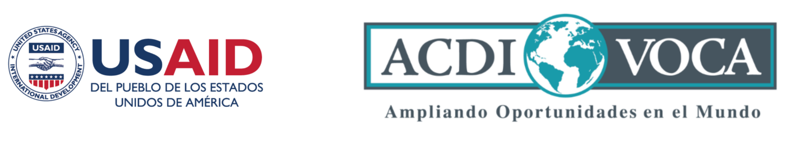

# Editorial
### Introducción
---
En esta entrega del Boletín Informativo de Buen Gobierno se informará sobre los 44 años de la ONIC, la movilización del primero de mayo, los avances del programa Juntanza Étnica y las columnas de opinión del Consejero Jaizareama Gerardo Jumi.

La ONIC saluda de manera fraterna a los lectores de este Boletín esperando que su contenido les sea útil para sus procesos internos y les recuerde que la ONIC tiene la esperanza en la consolidación de un movimiento indígena plural y unido que impulse el cumplimiento de la estrofa de su himno que expresa: “Con la fuerza de un pensar diverso resplandece orgullosa la ONIC, y retoma el luchar de mi ancestro que nos lleva a un próspero vivir...”.

### ONIC Casa grande de los Pueblos Originarios de Colombia; 44 años de Buen Gobierno
---
La Organización Nacional Indígena de Colombia (ONIC) y sus 54 organizaciones regionales filiales conmemoramos 44 años de existencia, la siembra realizada y el resurgimiento del movimiento indígena colombiano tras su constitución.

Fotografía: Asamblea Nacional de Autoridades Indígenas de la ONIC, abril de 2024

Durante este caminar, la ONIC ha logrado consolidarse como Autoridad Nacional de Gobierno Indígena y un referente de buen gobierno por su capacidad demostrada para liderar y acompañar a los Pueblos Indígenas en sus distintos procesos que han favorecido la unidad, el territorio, la cultura y la autonomía como estrategias de resistencia, pervivencia, paz y buen vivir. También, por la claridad de su plataforma de lucha, el fortalecimiento constante de las capacidades de sus 10 Consejerías, el trabajo permanente de las organizaciones regionales y las comunidades de base, la implementación de los mandatos estatutarios[^1] y políticos expresados en los Congresos Nacionales de los Pueblos Indígenas y la Ley de Gobierno Propio que se generó en dos periodos de gobierno (2012 - 2021), asimismo, ha logrado consolidarse como referente de buen gobierno por el aporte valiente de cada uno de nuestros ancestros, ancestras, sabios, sabias, médicos tradicionales, mujeres, niños, niñas, jóvenes, hombres, guardias, líderes, lideresas, consejeros y consejeras que han representado a los Pueblos Indígenas que se encuentran bajo la cobertura de la ONIC.

Los anteriores resultados se han logrado en medio de difíciles situaciones generadas por el conflicto armado, el racismo estructural, el colonialismo intelectual y la renuencia de varios gobiernos a la aplicación de la Constitución Política de 1991 y de instrumentos internacionales como el Convenio 169 de la OIT a favor de los derechos de los Pueblos Indígenas. Si bien este camino recorrido por la ONIC no ha sido fácil, se ha recorrido con la convicción de que toda buena semilla sembrada dará frutos a favor de la materialización de los derechos de nuestros 115 Pueblos Indígenas.

Este tejido de 44 años ha dejado a la ONIC un acumulado de aprendizajes, saberes, legados, resultados positivos y nuevos retos por afrontar, entre estos: Aumento de la autonomía económica de los Pueblos Indígenas para que transiten hacia una real autonomía política y puesta en marcha de acciones concretas dirigidas a impulsar el regreso al orígen, la protección de los sistemas de conocimientos ancestrales, la sistematización de la memoria organizativa, la materialización de los derechos de la la Madre Tierra y la ejecución del Plan Estratégico de la ONIC como marco rector que orientará sus acciones para dar cumplimiento al conjunto de mandatos estatutarios y políticos recibidos por sus autoridades.

Así entonces, la conmemoración de los primeros 44 años de la ONIC es una oportunidad histórica para repensarnos, proyectarnos, redireccionar nuestra acción organizativa y reconocer que seguiremos caminando la palabra de vida y fortaleciendo nuestras capacidades para estar cada vez más cerca de las comunidades y las organizaciones regionales para que así se materialice el lema “la ONIC es el sol que alumbra para todos”, lo anterior, como apuesta de buen gobierno de conformidad a los mandatos 7 y 21 de la Ley de Gobierno Propio.

Finalmente, debemos trabajar más para contribuir significativamente a mejorar las condiciones de buen vivir de los Pueblos y Naciones Indígenas de Colombia que anhelan volver al origen, que lata más fuerte el corazón de la lucha indígena y que la ONIC se siga fortaleciendo como la casa grande, la casa de todos. Sin duda el cumplimiento de esta tarea se logrará en la medida en que todos los que hacemos parte de la ONIC contribuyamos a la consolidación, el fortalecimiento, la dinamización e implementación de un Sistema de Buen Gobierno que favorezca a las 5 macro regionales e impulse tanto la unidad en medio de la diferencias como la valoración de los aportes y avances construidos conjuntamente con las organizaciones regionales y las comunidades de bases.

La ONIC mira el futuro con esperanza y ratifica que seguirá luchando hasta que se apague el sol; en consecuencia, redoblará esfuerzos para el cumplimiento de los mandatos recibidos por sus
autoridades para consolidarse como el sol que alumbra para todos.

# Actualidad de los Pueblos Indígenas de Colombia
 
### Los Pueblos Originarios de Colombia nos movilizamos el 1 de mayo
----

La ONIC y parte de nuestros Pueblos Originarios y las guardias indígenas (de Norte a Sur y de Oriente a Occidente desde la Alta Guajira pasando por Valledupar, Cali, Popayán, Pereira, Ibagué, Neiva y Saravena) nos hicimos partícipes de las movilizaciones que se realizaron en Colombia en conmemoración del primero de mayo Día Internacional de los Trabajadores, exigiendo mejores condiciones y estabilidad laboral para los trabajadores que tanto han aportado a la construcción de un mejor país.

Además, participamos en las movilizaciones en defensa de los derechos de los Pueblos Indígenas y de los demás colombianos, asimismo, en apoyo a las transformaciones regionales con inversión social y las reformas estructurales del país solicitados por el mandato popular y concertadas en su momento entre el Gobierno Nacional y el Gobierno Indígena, convencidos que es posible construir una Colombia multicolor que incluya la materialización real de los derechos de todos los Pueblos Indígenas a partir de una agenda propia y propuestas de solución a las problemáticas que les afectan.

También, participamos en las movilizaciones para exigir adecuaciones institucionales de las entidades y la aceleración tanto de la ejecución presupuestal como de la implementación de los acuerdos del Plan Nacional de Desarrollo (PND) 2022 - 2026 Colombia Potencia Mundial de la Vida a favor de las comunidades indígenas mediante Planes de Desarrollo Municipales y Departamentales.

A propósito de los acuerdos concertados en el PND, a continuación, se presentan algunos:Expedición del Decreto de Autoridad Ambiental Indígena y el desarrollo de consultas previas de las reformas a la salud, la educación y la Ley de Víctimas, necesarias para la puesta en marcha del Sistema de Educación Indígena Propio - SEIP-, el Sistema Indígena de Salud Propia e Intercultural -SISPI- y el fortalecimiento de los mecanismos de autoprotección colectivos como parte de la implementación del Capítulo Étnico del Acuerdo Final de Paz. Al respecto es relevante mencionar que estos acuerdos no han sido cumplidos adecuadamente por ninguno de los anteriores gobiernos.

Finalmente, participamos en las movilizaciones del primero de mayo para exigir la paz total; exigibilidad que se justifica por la actual crisis o estado de emergencia en el que se encuentran los Pueblos Indígenas, declarada desde el 2019 [^2] ; que en lugar de mejorar ha empeorado como lo constata el primer informe de 2024 de la Consejería de Derechos de los Pueblos Indígenas, Derechos Humanos y Paz denominado Memoria de Vida y Armonías, que expresa que desde el 2016 [^3] hasta la fecha se han registrado 2.335 casos integrado por 174.612 víctimas indígenas en todo el territorio nacional, afectando principalmente al Chocó con un 71% y al nodo Cauca, Valle del Cauca y Nariño con un 14,6% ante la presencia de la violencia armada ligada al control territorial para el desarrollo de economías ilegales. Sumado a ello sigue vigente la alta mortalidad infantil
indígena a razón de la desnutrición, especialmente en los departamentos de Vichada, La Guajira y
Chocó [^4].

Bajo este panorama de movilizaciones realizadas el primero de mayo, es importante resaltar que las
comunidades y organizaciones filiales a la ONIC participamos desde nuestra autonomía y particularidades culturales mediante diferentes formas de movilización: espiritual, cultural, simbólica, pedagógica y física desde las calles, tambos, malokas, bohíos, kankuruas, escuelas, parques, entre otros lugares. Lo anterior, en tanto nos asiste la certeza que la movilización y la minga no es ajena a nuestros Pueblos Indígenas, por el contrario, ha hecho parte de nuestra historia, lucha y esencia de ser indígena; de hecho, desde tiempos milenarios ha constituido nuestra estrategia legítima y propia para pervivir, proteger, exigir, denunciar, visibilizar, incidir y conquistar reivindicaciones y derechos como la autodeterminación, la autonomía, los territorios, los sistemas propios y la salvaguarda de nuestras culturas. Lo anterior, en coherencia con los mandatos de los Estatutos, los Congresos Nacionales de Pueblos Indígenas y la Ley de Gobierno Propio que exigen a la ONIC impulsar y participar activamente en procesos de movilización, actuar motivada por la solidaridad y fortalecer su relacionamiento con los distintos sectores sociales, populares y étnicos (Mandatos de la Ley de
Gobierno Propio: 5.8 - Literales A / B / C, 15 - Literal C - y 16 Literales D / G / M).

# Avances del programa Juntanza Étnica en ONIC

###  "ONIC y ACDI VOCA unen esfuerzos en un proyecto para empoderar a comunidades indígenas en Colombia"
---

Fotografía: Mujer Emberá Katió participante de la Asamblea Nacional de Autoridades Indígenas de la ONIC, abril de 2024.

La ONIC desde el año 2021 ha venido adelantando un modelo de trabajo colaborativo con ACDI
VOCA de la Agencia de los Estados Unidos para el Desarrollo Internacional (USAID); gracias a ello
en la actualidad se desarrolla el Proyecto: Empoderamiento de los pueblos indígenas de la ONIC
mediante el fortalecimiento organizativo, la diplomacia indígena, el impulso de las economías propias,
la cultura y la atención al riesgo, en el marco del Programa Juntanza Étnica.

En este proyecto participan activamente las Consejerías: (i) Mujer, Familia y Generación, (ii)
Planeación, Administración y Finanzas, y, (iii) Secretaría General. El desarrollo de este proyecto
busca fortalecer las capacidades organizacionales de la ONIC para lograr una mayor incidencia
política y una gestión efectiva de recursos que provienen de la cooperación internacional. Son
beneficiarias del Proyecto las organizaciones filiales de la ONIC de La Guajira, Chocó, Nariño, Valle
del Cauca, Amazonas y Bogotá que se relacionan en la siguiente tabla.

Tabla 1: Organizaciones y comunidades con las que se relaciona el proyecto de Empoderamiento de la ONIC en el marco del programa Juntanza Étnica.

Es importante resaltar que la ONIC ha logrado mediante este Proyecto fortalecer y llegar a sus
organizaciones filiales, trabajando conjuntamente con estas para el desarrollo de los mandatos del X
Congreso Nacional de Pueblos Indígenas y haciendo uso de las herramientas tecnológicas
fortaleciendo a la ONIC como Autoridad Nacional de Gobierno Indígena.

En el marco de este Proyecto, la Consejería de Mujer, Familia y Generación tiene a su cargo las líneas de: (i) Empoderamiento a las Mujeres Indígenas y; (ii) Empoderamiento Cultural. La Consejería definió la estrategía Tejiendo Redes para la Cultura y Unidad de las Mujeres Indígenas que se desarrollará a partir de 7 módulos de trabajo que se imparten desde mayo de manera virtual contemplando los siguientes temas: Liderazgo, Derechos de las Mujeres Indígenas y Prevención de Desarmonías.

Fotografía: Participación de la ONIC en la Exposición de Cafes de Colombia Expo 2023 con su marca Semilla Nativa. Fuente: Instagram @semillanativa_indigena

- Fortalecimiento a 18 organizaciones, cabildos y resguardos indígenas, a partir de la transferencia de conocimientos y asesoría en administración propia, economías propias, enfoque de mujer, control territorial,
comunicaciones, entre otros; con la finalidad de aportar a sus capacidades administrativas, técnicas y financieras, para una mayor gestión de recursos desde los territorios.

- Diagnóstico de la forma en que los Pueblos Indígenas pensamos y sentimos nuestras economías propias y la soberanía alimentaria mediante diálogo de saberes.

- Registro y caracterización de 334 unidades económicas o de emprendimiento de los territorios focalizados en el Proyecto.

- Construcción de los contenidos de las capacitaciones de fortalecimiento comercial y producción de abonos orgánicos como herramienta para el fortalecimiento de la soberanía alimentaria.

- Desarrollo de seguimiento a la entrega de los productos técnicos en el marco del convenio,así como de la efectiva ejecución financiera del mismo, para garantizar que la implementación del Proyecto cumpla con los requerimientos técnicos para ser presentados al cooperante según sus solicitudes.

Fotografía: Altar a las Semillas Nativas de los 10 resguardos indígenas accionante de la Tutela contra el Ministerio de Agricultura por daños irreversibles a los maíces nativos por contaminación transgénica.

La Consejería Secretaría General lidera la línea de Construcción de Paz Territorial y Diplomacia Indígena, Comunicación y Gestión del Riesgo.

Por su parte, la Consejería Secretaría General lidera tres líneas: (i) Buen Gobierno; (ii) Gestión del
Riesgo; (iii) Construcción de Paz Territorial y Diplomacia Indígena. Sus principales avances son:

- Desarrollo de la convocatoria e inscripción de jóvenes de las organizaciones filiales participantes
en el Proyecto a 6 módulos de formación e intercambio de saberes sobre Paz Territorial y Diplomacia Indígena.

- Visibilización y posicionamiento político de la ONIC ante medios de comunicación y fortalecimiento del
contenido publicado en la web y redes sociales de la ONIC, como herramienta necesaria para la
incidencia política.

Fotografía: Participación de la ONIC en la movilización del 27 de septiembre de 2023.

- Fortalecimiento de los procesos de articulación con las Consejerías de la ONIC, especialmente con las
Consejerías de: Mujer, Familia y Generación, Planeación, Administración y Finanzas, así como con la de Derechos de los Pueblos Indígenas, Derechos Humanos y Paz.

- Fortalecimiento de la ONIC mediante el desarrollo de un aplicativo que permitirá realizar seguimiento y
evaluación al cumplimiento del Plan Estratégico de la ONIC por parte de las 10 Consejerías; el aplicativo
próximamente se entregará al Consejo Mayor de Gobierno para su respectiva aprobación.

- Producción del Informativo de Buen Gobierno, que se estará actualizando periódicamente y servirá para
visibilizar las problemáticas de los Pueblos Indígenas y los logros de buen gobierno de la ONIC.

- Recolección de información en campo para avanzar en los productos de la línea de Gestión del Riesgo:
(i) Construcción de panoramas en riesgo para cada organización indígena participante; (ii) Metodología
para articular acciones de prevención, protección y manejo de desastres con entidades territoriales
priorizadas; (iii) Propuesta para la creación del fondo de emergencias de la ONIC; (iv) Realización de
cartografía para el mapeo e identificación de comunidades en riesgo y con amenazas naturales. A
la vez, incluyendo el componente de cambio climático y mapas de localización. Para dar cumplimiento a los productos mencionados fue necesario la realización de relacionamiento y despliegue en territorio.

De está manera el proyecto de fortalecimiento organizativo permite mejorar nuestras capacidades promoviendo el trabajo colaborativo entre las Consejerías de cara a llegar a las comunidades llevando a cabo nuestros mandatos estratégicos como lo es el tejido entre mujeres indígenas, la construcción de paz territorial y el desarrollo propio para el desarrollo de la visión de nuestra Ley de Gobierno Propio.

Fotografía: Imagen de la estrategía Tejiendo Redes para la cultura y unidad de las Mujeres Indígenas de la Consejería Mujer, Familia y Generación.

# Publicaciones del Consejero Jaizareama Gerardo Jumi

### ¡Nos están matando y el Fiscal Barbosa no hizo nada! ¡Los Pueblos Indígenas de Colombia exigen el cambio de Fiscal ya!
---

El Informe del Observatorio de Derechos Humanos de los Pueblos Indígenas de la ONIC de 2023 demuestra en cifras la ineficacia de la Fiscalía colombiana ante el genocidio de los Pueblos Indígenas. La ONIC exige la elección urgente de una nueva fiscal comprometida con la justicia para que nunca se repitan los hechos aberrantes que se han presentado contra los Pueblos Indígenas. <a href="https://www.revistaraya.com/gerardo-jumi/589-nos-estan-matando-y-el-fiscal-barbosa-no-hizo-nada-los-pueblos-indigenas-de-colombia-exigen-el-cambio-de-fiscal-ya.html" target="_blank">ver aquí</a> 

#### Raíces del genocidio: Gaza y territorios indígenas
---
En medio de la tragedia de miles de palestinos que están siendo asesinados, a la vez, existen múltiples genocidios contra nuestros Pueblos indígenas en Colombia, en común tienen el interés económico que brindan las riquezas de estos territorios y lo incómodo que pueden ser las comunidades locales. Se resalta la lucha del gran Kimy Pernía por defender el Río Sinú, territorio de los Emberá Katio, y el desenlace fatídico en manos del paramilitar Salvatore Mancuso. De todas maneras la resistencia persiste y la solidaridad entre Pueblos también, el llamado es a realizar la economía propia del buen vivir. <a href="https://revistaraya.com/gerardo-jumi/598-raices-del-genocidio-gaza-y-territorios-indigenas.html" target="_blank">ver aquí</a>

            
 Si quieres, puedes reenviar este boletín a tus contactos o decirles que se apunten
                <a href="#" class="text-white">aquí</a>. Puedes escribirme con ideas, comentarios y sugerencias a sistemabuengobierno@onic.org.co
                o a mi cuenta de Twitter: @GerardoJumi

El contenido en esta página web no es información oficial del Gobierno de Estados Unidos y no representa las opiniones o las posiciones de la Agencia de Estados Unidos para el Desarrollo Internacional (USAID).

# Referencias

[^1]:Estatutos de 2003 de la ONIC registrados en la Cámara de Comercio.

[^2]: Declaración de Emergencia Humanitaria de y por los Pueblos Indígenas, 09 de agosto de 2019. Disponible en: <a href="https://www.onic.org.co/comunicados-onic/3105-declaracion-de-emergencia-humanitaria-de-y-por-los-pueblos-indigenas" target="_blank">ver aquí</a>

[^3]: Información sistematizada en el Observatorio de Derechos Humanos de la ONIC desde 2016 como esfuerzo propio para monitorear la situación territorial de Derechos Humanos de acuerdo a la política del Acuerdo Final de Paz.

[^4]: Ministerio de Salud y Protección Social/Instituto Nacional de Salud./Instituto Colombiano de Bienestar Familiar. Boletín de Prensa No 04 de 2024, Disminuye la mortalidad por desnutrición aguda en niños y niñas menores de cinco años en el país. Disponible en: <a href="https://www.minsalud.gov.co/Paginas/Disminuye-la-mortalidad-por-desnutricion-aguda-en-ninos-y-ninas-menores-de-cinco-anos-en-el-pais.aspx" target="_blank">ver aquí</a>

[^6]: Intervención de la Compañera Emberá Chami Directora de la Unidad para la Atención y Reparación Integral a las Víctimas Patricia Tobón ante la Corte Constitucional en la sesión técnica de la Sala Especial de Seguimiento a la Sentencia T-025 de 2004, 10 de mayo de 2024.

