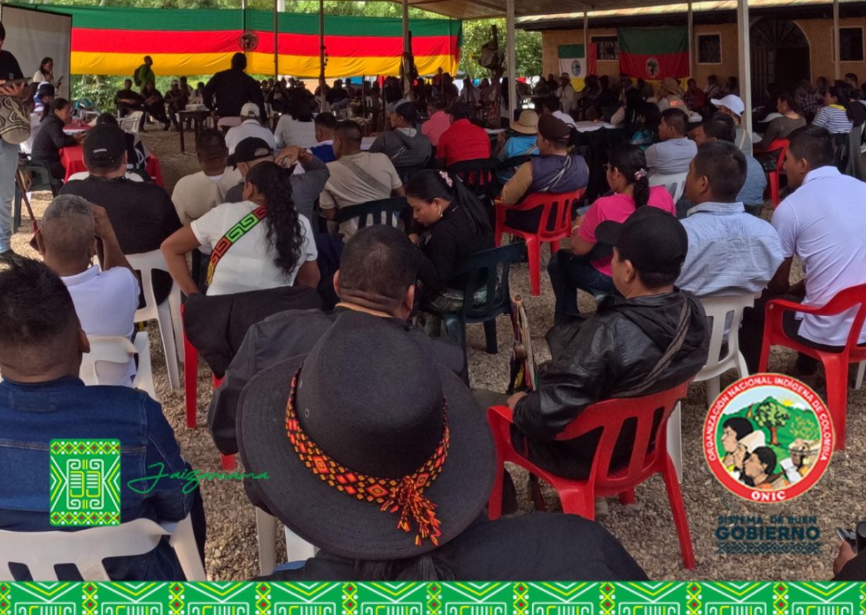
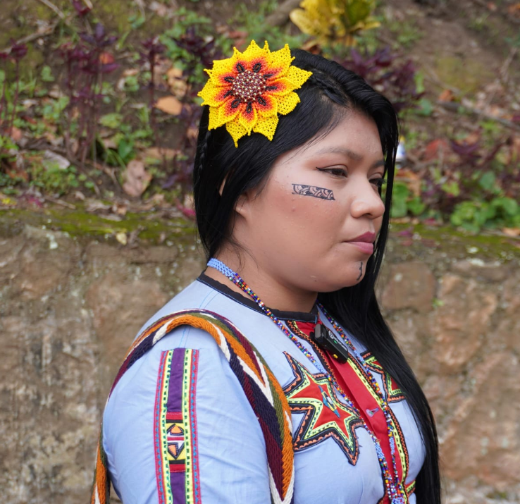
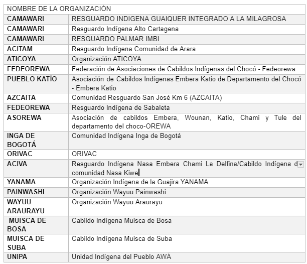
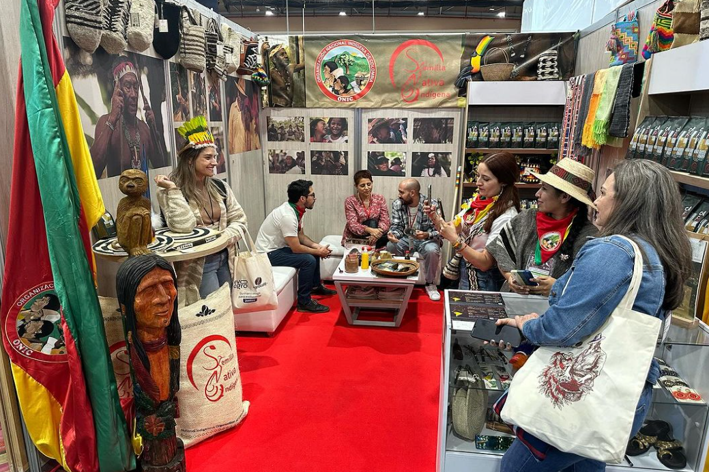
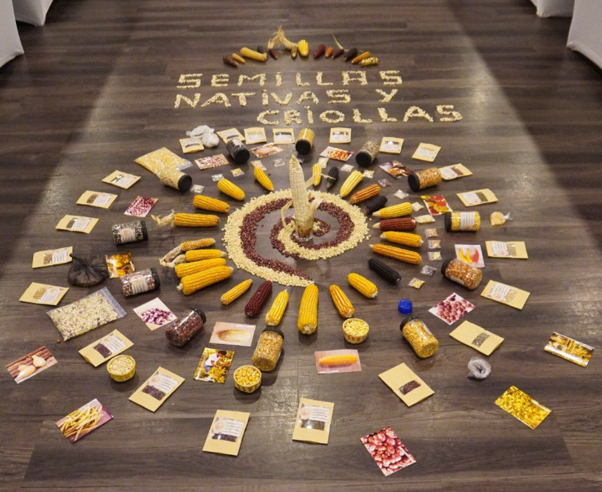
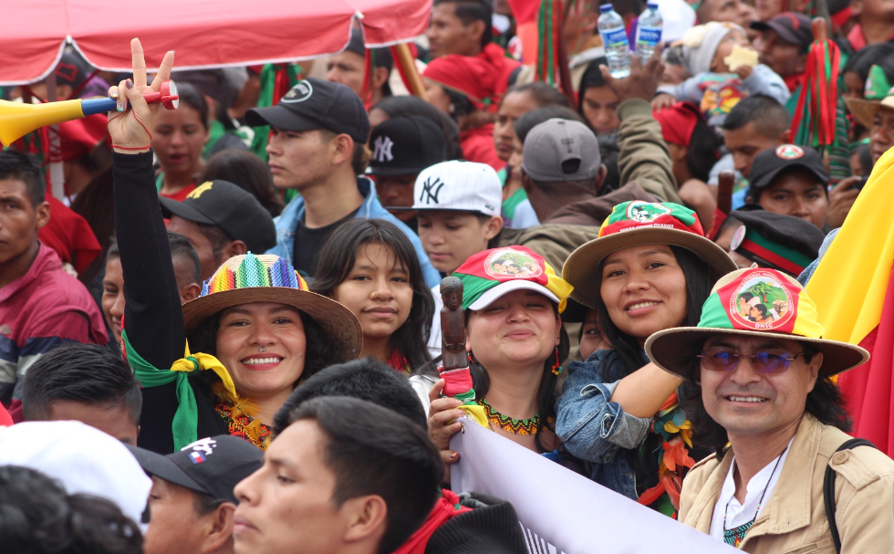
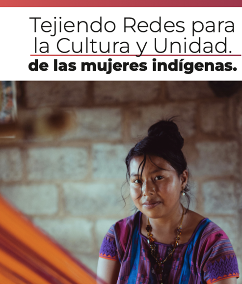

# Editorial

### 44 años de lucha del movimiento indígena colombiano, luchando por la UNIDAD hacia un Buen Gobierno de la ONIC
---
En el seno del resurgimiento del movimiento indígena Colombiano estructuramos hace 44 años la ONIC, la Consejería Secretaría General conforma el Sistema de Buen Gobierno donde se retoma el mandato 21 de la Ley de Gobierno Propio, en tanto es fundamental para orientar y dirigir efectivamente nuestras luchas por la Pervivencia física y cultural de nuestros Sistemas de Gobierno. 

Fotografía: Asamblea Nacional de Autoridades Indígenas de la ONIC, abril de 2024

Reconocemos el legado y el papel histórico que como Pueblos Originarios caminamos en las rutas trazadas en nuestros relatos de origen para defender nuestros territorios. Es así que en el seno del resurgimiento del movimiento indígena Colombiano estructuramos hace 44 años la ONIC desde el saber acumulado: en el origen del tiempo, en nuestras comunidades y organizaciones para la pervivencia de nuestros Pueblos en medio de las difíciles situaciones de conflicto armado, de racismo estructural y de colonialismo intelectual que amenaza permanente con nuestra extinción.

Reconocemos el legado y el papel histórico que como Pueblos Originarios caminamos en las rutas trazadas en nuestros relatos de origen para defender nuestros territorios. Es así que en el seno del resurgimiento del movimiento indígena Colombiano estructuramos hace 44 años la **ONIC** desde el saber acumulado: en el origen del tiempo, en nuestras comunidades y organizaciones para la pervivencia de nuestros Pueblos en medio de las difíciles situaciones de conflicto armado, de racismo estructural y de colonialismo intelectual que amenaza permanente con nuestra extinción. 

Es connatural a nosotros como Pueblos Originarios repensarnos, asumir los aprendizajes y redireccionar nuestra acción organizativa, prueba de ello es la gestación de la Ley de Gobierno Propio de la ONIC que se produjo en dos periodos de gobierno entre el año 2012-2021 y fue en el X Congreso de los Pueblos Indígenas de la ONIC que se refrendó este acuerdo procurando siempre por la **UNIDAD** de los Pueblos Indígenas de Colombia sabiendo la fuerza de un movimiento indígena diverso pero unido para **PERVIVIR**. La Consejería Secretaría General retoma el mandato 21 Buen Gobierno de la Ley de Gobierno Propio ya que es fundamental para la ONIC fortalecer y dirigir los esfuerzos efectivamente a la par que se evidencia su gestión de manera transparente y se incorporan los códigos de ética y control social donde prime la construcción de acuerdos sociales para que prevalezca el interés colectivo sobre el individual garantizando así la vida, los territorios y los sistemas de pensamiento y gobierno para nuestras semillas de vida y el equilibrio de la Madre Tierra como casa de todos.

En ese sentido la Consejería Secretaría General crea y dinamiza el Sistema de Buen Gobierno para que apoye la función directiva del Consejo Mayor de Gobierno y de la Asamblea Nacional de Autoridades dando lugar a la sistematización y seguimiento de la Planeación Estratégica de la **ONIC**[^1] sistematizando la Memoria Institucional y brindando información actualizada del ámbito político que atañe a los Pueblos Indígenas especialmente en el orden nacional e internacional.

En esta entrega del Boletín Informativo del Sistema de Buen Gobierno se informará sobre los avances en la adopción del Plan Estratégico de la ONIC por el Consejo Mayor de Gobierno, la movilización de la ONIC en el marco del primero de Mayo Dia Internacional de los Trabajadores, avances del programa Juntanza Étnica en la ONIC y se relacionan las columnas de opinión del Consejero Jaizareama Gerardo Jumi. Para nuestros lectores que el contenido que encuentre en estas letras recuerden la fuerza y la esperanza que tenemos en un movimiento indígena plural y unido, como lo menciona el coro de nuestro glorioso himno: “Con la fuerza de un pensar diverso resplandece orgullosa la ONIC, y retoma el luchar de mi ancestro que nos lleva a un próspero 
vivir…”.

# Actualidad de los Pueblos indígenas de la ONIC
 
### Los Pueblos Originarios de Colombia nos movilizamos el 1 de mayo, por respeto y ejercicio de nuestros derechos.
----

Los Pueblos Originarios de Colombia participamos en apoyo a las marchas que se hacen en conmemoración del Día Internacional de los Trabajadores y nos unimos en apoyo a los cambios estructurales del presente Mandato Popular concertado.

Nos movilizamos de Norte a Sur, de Oriente a Occidente en el territorio nacional, desde la Alta Guajira, Valledupar, Cali, Popayán, Pereira, Ibagué, Neiva y Saravena, y en nuestros espacios sagrados, porque estamos convencidos que es hora de transitar a un mandato popular que le cumpla a los Pueblos Originarios, ya que somos elementos esenciales en las transformaciones del país, asumimos el mandato de ser como el Sol: alumbrar para todos, y seguir luchando hasta que se apague el Sol.

Marchamos apoyando las reformas sociales porque ese ha sido un mandato popular que concertamos entre el Gobierno Nacional y el Gobierno Indígena. Para la ONIC los acuerdos y alcances que concertamos en el Plan Nacional de Desarrollo: Colombia Potencia Mundial de la Vida deben de ser implementados con celeridad, los acuerdos de consulta en las reformas a la Salud y Educación y Víctimas Indígenas deben de ser implementados vía legislativa o ejecutiva con urgencia para la puesta en marcha del i) Sistema de Educación Indígena Propio, ii) Sistema Indígena de Salud Propia e Intercultural y iii) los mecanismos de Autoprotección Colectivos, recordando los compromisos pendientes en la implementación del Capítulo Étnico del Acuerdo Final de Paz donde la adecuación institucional[^2] y los decretos de Autoridad Ambiental Indígenas están sobre la mesa para resolverse. Los mencionados y otros compromisos de Mingas son viejos acuerdos pactados de Gobierno a Gobierno y no han sido cumplidos adecuadamente por ninguno de los gobiernos antecesores al presente.

Recordamos que nos encontramos en **Estado de Emergencia**, como lo declaramos desde el año 2019[^3], el cual no ha podido ser levantado pues las desarmonías y vulneraciones han empeorado desde ese tiempo, esto se constata en el primer informe de 2024 de la Consejería de Derechos de los Pueblos Indígenas, Derechos Humanos y Paz: Memoria de Vida y Armonías. Desde el 2016[^4] se registran 2335 casos con 174.612 víctimas indígenas, en todo el territorio nacional, las situaciones prevalecen en Chocó con un 71% y el nodo: Cauca, Valle del Cauca y Nariño con un 14,6%, estos casos son de especial atención en términos de presencia y permanencia de la violencia armada ligadas al control territorial para el desarrollo de economías ilegales. Sumado a ello las situaciones de mortalidad infantil y desnutrición afecta a nuestra semillas de vida (niños y niñas indígenas) especialmente en los departamentos de Vichada, La Guajira y Chocó[^5].

Hacemos un llamado al poder judicial para garantizar Justicia y frenar urgentemente todas las prácticas de injusticia, racismo institucional y genocidio contra los Pueblos Originarios de Colombia. Existen muchas sentencias de la Corte Constitucional que ordenan acciones específicas a las instituciones para el goce efectivo de los Derechos de los Pueblos Indígenas las cuales hoy cuentan con un bajo cumplimiento, esto se debe en parte a la falta del desarrollo de los derechos estructurales consignados en la Constitución para Pueblos Indígenas y al déficit en el entendimiento de los Derechos étnicos por parte de las instituciones del Estado[^6]

Esperamos de la Fiscalía General de la Nación, en cabeza de la Sra. Luz Adriana Camargo, procure por incorporar un direccionamiento con enfoque indígena para que las entidades de justicia a su cargo superen el alto grado de impunidad en los casos relacionados a población indígena, se investiguen los casos de corrupción en recursos del Estado que deben beneficiar a las poblaciones indígenas y se corrijan las prácticas de racismo institucional en las diferentes instancias del Estado.

Ante los pronunciamientos públicos del exvicepresidente Santos contra la ONIC, días antes del 1 de mayo, el Consejero Jumi ha interpuesto una acción de tutela y una demanda penal por discriminación  solicitando además una rectificación de manera pública ante el uso de expresiones racistas, xenofobicas y discriminatorias que hostigan y ponen en peligro nuestras vidas. 

Somos gente de Minga y de movilización, es parte de nuestra naturaleza colectiva y hace parte de nuestra esencia de ser Pueblos Originarios, de hecho, es nuestra estrategia milenaria y propia para pervivir y protegernos a partir de la cual hemos logrado exigir, denunciar, visibilizar, incidir y lograr el reconocimiento de nuestros derechos que van sobre los rieles de nuestros principios Territorio, Autonomía, Cultura y Unidad dirigidos a la reparación, restauración y ejercicio de nuestros Sistemas de Gobierno Propio.

# Avances del Programa Juntanza Étnica en ONIC

###  "ONIC y ACDI VOCA unen esfuerzos en proyecto para empoderar a comunidades indígenas en Colombia"
---

Fotografía: Mujer Emberá Katió participante de la Asamblea Nacional de Autoridades Indígenas de la ONIC, abril de 2024.

La ONIC desde el año 2021 ha venido ajustando un modelo de trabajo colaborativo con la agencia ACDI VOCA de la USAID para desarrollar el programa Juntanza Étnica llegando al acuerdo en el año 2023 de desarrollar el Proyecto: Empoderamiento de los pueblos indígenas de la ONIC mediante el fortalecimiento organizativo, la diplomacia indígena, el impulso de las economías propias, la cultura y la atención al riesgo, en este proyecto participan activamente las Consejerías: i) Mujer, Familia y Generación, ii) Planeación, Administración y Finanzas, y, iii) Secretaría General. El desarrollo de este proyecto busca fortalecer las capacidades organizacionales de la ONIC para lograr una mayor incidencia política y una gestión efectiva de recursos que provienen de la Cooperación en todo el territorio nacional. Proyecto que llega a las organizaciones filiales de la ONIC en La Guajira, Chocó, Nariño, Valle del Cauca, Amazonas y Bogotá (Tabla 1).

Tabla 1: Organizaciones y comunidades con las que se relaciona el proyecto de Empoderamiento de la ONIC en el marco del programa Juntanza Étnica.

La consejería de Planeación, Administración y Finanzas lidera las líneas de fortalecimiento organizativo a través de la aplicación del Índice de Capacidades a Organizaciones Étnicas - ICOE y la línea de Economías Propias, así mismo lleva actividades relacionadas con el seguimiento administrativo y presupuestal del proyecto. Sus principales avances son:

Fotografía: Participación de la ONIC en la Exposición de Cafes de Colombia Expo 2023 con su marca Semilla Nativa. Fuente: Instagram @semillanativa_indigena

- Fortalecimiento a 18 organizaciones, cabildos y resguardos indígenas, brindando transferencia de conocimientos y asesoría en administración propia, temáticas en economías propias, enfoque de mujer, control territorial, comunicaciones, entre otros; con la finalidad de aportar a sus capacidades administrativas, técnicas y financieras, para una mayor gestión de consecución de los recursos desde los territorios.

- Diagnóstico de la forma en que los Pueblos Indígenas pensamos y sentimos nuestras economías propias y la soberanía alimentaria mediante diálogo de saberes. Además, se realizó el registro y caracterización de 334 unidades económicas o de emprendimiento de los territorios focalizados en el proyecto. También se construyó los contenidos de las capacitaciones de fortalecimiento comercial, y producción de abonos orgánicos como herramienta del fortalecimiento de la soberanía alimentaria.

- En términos administrativos, desde esta consejería se desarrolla el seguimiento y entrega de los productos técnicos en el marco del convenio, así como de la efectiva ejecución financiera del mismo, logrando que la implementación del proyecto a la fecha esté cumpliendo con los requerimientos técnicos para ser presentados al cooperante según sus solicitudes.

Fotografía: Altar a las Semillas Nativas de los 10 resguardos indígenas accionante de la Tutela contra el Ministerio de Agricultura por daños irreversibles a los maíces nativos por contaminación transgénica.

La Consejería Secretaría General lidera la línea de Construcción de Paz Territorial y Diplomacia Indígena, Comunicación y Gestión del Riesgo. Sus principales avances son:

- Desarrollar la convocatoria para incorporar a los jóvenes indígenas líderes en la recepción de seis módulos que desarrollaran las competencias y habilidades en la incidencia política y el uso de medios de comunicación para el desarrollo de sus liderazgos actualizando los debates y asumiendo desde los jóvenes las agendas a posicionar con las instancia de gobierno. Se ha desarrollado una estrategia para mejorar el rendimiento de las  redes sociales de la ONIC y así acompañar mediáticamente la incidencia política de la ONIC.

Fotografía: Participación de la ONIC en la movilización del 27 de septiembre de 2023.

- Fortalecer a la ONIC desarrollando un aplicativo para la ONIC que permita el seguimiento y evaluación del Plan Estratégico de la ONIC el cual ha permitido desarrollar la línea de Buen Gobierno a cargo de la Consejería Secretaría General, al momento se tiene el aplicativo en prueba para entrega al Consejo Mayor de Gobierno y la producción del Informativo de Buen Gobierno.

- Realización de la fase de relacionamiento y despliegue en territorio para el avance en la fase de aplicación de herramientas para la recolección de información en campo de la línea de Gestión del Riesgo Indígena. Se han entregado avances de los productos: i. Construcción de panoramas en riesgo para cada organización indígena, ii. Metodología para articular acciones de prevención protección y manejo de desastres con entidades territoriales priorizadas, iii. Propuesta para la creación del fondo de emergencias. Se realizó la cartografía para el mapeo e identificación de comunidades en riesgo, amenazas naturales existentes, componente cambio climático y mapas de localización de cada organización filial.

- La Consejería de Mujer, Familia y Generación tiene a su cargo las líneas de Empoderamiento a las Mujeres indígenas y el de empoderamiento cultural. La Consejería definió la estrategía Tejiendo Redes para la cultura y unidad de las Mujeres Indígenas, son 7 módulos de trabajo que se impartirán de manera virtual y desarrollaran los temas de: Liderazgo, Derechos de las Mujeres Indígenas y Prevención de Desarmonías, el proceso dará inicio en el mes de mayo.

Fotografía: Imagen de la estrategía Tejiendo Redes para la cultura y unidad de las Mujeres Indígenas de la Consejería Mujer, Familia y Generación.

Es importante resaltar que la ONIC ha logrado mediante este proyecto fortalecer y llegar a sus Organizaciones filiales, trabajando conjuntamente, desarrollando los mandatos del X congreso y haciendo uso de las herramientas tecnológicas fortaleciendo a la ONIC como Autoridad Nacional de Gobierno Indígena. 

# Publicaciones del Consejero Jaizareama Gerardo Jumi

### ¡Nos están matando y el fiscal Barbosa no hizo nada! ¡Los Pueblos Indígenas de Colombia exigen el cambio de fiscal ya!
---

El Informe del Observatorio de Derechos Humanos de los Pueblos Indígenas de la ONIC de 2023 demuestra en cifras la ineficacia de la Fiscalía colombiana ante el genocidio de los Pueblos Indígenas. La ONIC exige la elección urgente de una nueva fiscal comprometida con la justicia para que nunca se repitan los hechos aberrantes que se han presentado contra los Pueblos Indígenas. <a href="https://www.revistaraya.com/gerardo-jumi/589-nos-estan-matando-y-el-fiscal-barbosa-no-hizo-nada-los-pueblos-indigenas-de-colombia-exigen-el-cambio-de-fiscal-ya.html" target="_blank">ver aquí</a> 

#### Raíces del genocidio: Gaza y territorios indígenas
---
En medio de la tragedia de miles de palestinos están siendo asesinados, a la vez existen múltiples genocidios contra nuestros Pueblos indígenas en Colombia, en común tienen el interés económico que brindan las riquezas de estos territorios y lo incómodo que pueden ser las comunidades locales. Se resalta la lucha del gran Kimy Pernía por defender el Río Sinú, territorio de los Emberá Katio, y el desenlace fatídico de su defensa en manos del paramilitar Salvatore Mancuso. De todas maneras la resistencia persiste y la solidaridad entre pueblos también, el llamado es a realizar la economía propia del buen vivir. <a href="https://revistaraya.com/gerardo-jumi/598-raices-del-genocidio-gaza-y-territorios-indigenas.html" target="_blank">ver aquí</a>

            
 Si quieres, puedes reenviar este boletín a tus contactos o decirles que se apunten
                <a href="#" class="text-white">aquí</a>. Puedes escribirme con ideas, comentarios y sugerencias a sistemabuengobierno@onic.org.co
                o a mi cuenta de Twitter: @GerardoJumi

# 
El contenido en esta página web no es información oficial del Gobierno de Estados Unidos y no representa las opiniones o las posiciones de la Agencia de Estados Unidos para el Desarrollo Internacional (USAID).

## Referencias

[^1]: La planeación estratégica se enfocó en la implementación de la Ley de Gobierno Propio apoyándose en la revisión de los mandatos de los anteriores congresos y los estatutos de 2003 de ONIC protocolizados en la Cámara de Comercio.

[^2]: Se reconoce el esfuerzo de la Unidad de Víctimas por implementar decididamente el Capítulo Étnico del Acuerdo Final de Paz de acuerdo a la concertación en la Mesa Permanente de Concertación.desarrollada para el Plan Nacional de Desarrollo: Colombia Potencia Mundial de la Vida.

[^3]: Declaración de Emergencia Humanitaria de y por los Pueblos Indígenas, 09 de agosto de 2019. Disponible en: <a href="https://www.onic.org.co/comunicados-onic/3105-declaracion-de-emergencia-humanitaria-de-y-por-los-pueblos-indigenas" target="_blank">ver aquí</a>

[^4]: Información sistematizada en el Observatorio de Derechos Humanos de la ONIC desde 2016 como esfuerzo propio para monitorear la situación territorial de Derechos Humanos de acuerdo a la política del Acuerdo Final de Paz.

[^5]: Ministerio de Salud y Protección Social/Instituto Nacional de Salud./Instituto Colombiano de Bienestar Familiar. Boletín de Prensa No 04 de 2024, Disminuye la mortalidad por desnutrición aguda en niños y niñas menores de cinco años en el país. Disponible en: <a href="https://www.minsalud.gov.co/Paginas/Disminuye-la-mortalidad-por-desnutricion-aguda-en-ninos-y-ninas-menores-de-cinco-anos-en-el-pais.aspx" target="_blank">ver aquí</a>

[^6]: Intervención de la Compañera Emberá Chami Directora de la Unidad para la Atención y Reparación Integral a las Víctimas Patricia Tobón ante la Corte Constitucional en la sesión técnica de la Sala Especial de Seguimiento a la Sentencia T-025 de 2004, 10 de mayo de 2024.

