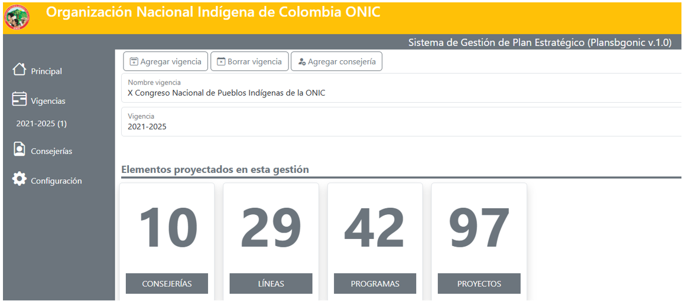

# Editorial
### Introducción
---
En esta entrega del Boletín Informativo de Buen Gobierno se informará sobre los 44 años de la ONIC, la movilización del primero de mayo, los avances del programa Juntanza Étnica y las columnas de opinión del Consejero Jaizareama Gerardo Jumi.

La ONIC saluda de manera fraterna a los lectores de este Boletín esperando que su contenido les sea útil para sus procesos internos y les recuerde que la ONIC tiene la esperanza en la consolidación de un movimiento indígena plural y unido que impulse el cumplimiento de la estrofa de su himno que expresa: “Con la fuerza de un pensar diverso resplandece orgullosa la ONIC, y retoma el luchar de mi ancestro que nos lleva a un próspero vivir...”.

### ONIC Casa grande de los Pueblos Originarios de Colombia; 44 años de Buen Gobierno
---
La Organización Nacional Indígena de Colombia (ONIC) y sus 54 organizaciones regionales filiales conmemoramos 44 años de existencia, la siembra realizada y el resurgimiento del movimiento indígena colombiano tras su constitución.

Fotografía: Asamblea Nacional de Autoridades Indígenas de la ONIC, abril de 2024

Durante este caminar, la ONIC ha logrado consolidarse como Autoridad Nacional de Gobierno Indígena y un referente de buen gobierno por su capacidad demostrada para liderar y acompañar a los Pueblos Indígenas en sus distintos procesos que han favorecido la unidad, el territorio, la cultura y la autonomía como estrategias de resistencia, pervivencia, paz y buen vivir. También, por la claridad de su plataforma de lucha, el fortalecimiento constante de las capacidades de sus 10 Consejerías, el trabajo permanente de las organizaciones regionales y las comunidades de base, la implementación de los mandatos estatutarios[^1] y políticos expresados en los Congresos Nacionales de los Pueblos Indígenas y la Ley de Gobierno Propio que se generó en dos periodos de gobierno (2012 - 2021), asimismo, ha logrado consolidarse como referente de buen gobierno por el aporte valiente de cada uno de nuestros ancestros, ancestras, sabios, sabias, médicos tradicionales, mujeres, niños, niñas, jóvenes, hombres, guardias, líderes, lideresas, consejeros y consejeras que han representado a los Pueblos Indígenas que se encuentran bajo la cobertura de la ONIC.

Los anteriores resultados se han logrado en medio de difíciles situaciones generadas por el conflicto armado, el racismo estructural, el colonialismo intelectual y la renuencia de varios gobiernos a la aplicación de la Constitución Política de 1991 y de instrumentos internacionales como el Convenio 169 de la OIT a favor de los derechos de los Pueblos Indígenas. Si bien este camino recorrido por la ONIC no ha sido fácil, se ha recorrido con la convicción de que toda buena semilla sembrada dará frutos a favor de la materialización de los derechos de nuestros 115 Pueblos Indígenas.

Este tejido de 44 años ha dejado a la ONIC un acumulado de aprendizajes, saberes, legados, resultados positivos y nuevos retos por afrontar, entre estos: Aumento de la autonomía económica de los Pueblos Indígenas para que transiten hacia una real autonomía política y puesta en marcha de acciones concretas dirigidas a impulsar el regreso al orígen, la protección de los sistemas de conocimientos ancestrales, la sistematización de la memoria organizativa, la materialización de los derechos de la la Madre Tierra y la ejecución del Plan Estratégico de la ONIC como marco rector que orientará sus acciones para dar cumplimiento al conjunto de mandatos estatutarios y políticos recibidos por sus autoridades.

Así entonces, la conmemoración de los primeros 44 años de la ONIC es una oportunidad histórica para repensarnos, proyectarnos, redireccionar nuestra acción organizativa y reconocer que seguiremos caminando la palabra de vida y fortaleciendo nuestras capacidades para estar cada vez más cerca de las comunidades y las organizaciones regionales para que así se materialice el lema “la ONIC es el sol que alumbra para todos”, lo anterior, como apuesta de buen gobierno de conformidad a los mandatos 7 y 21 de la Ley de Gobierno Propio.

Finalmente, debemos trabajar más para contribuir significativamente a mejorar las condiciones de buen vivir de los Pueblos y Naciones Indígenas de Colombia que anhelan volver al origen, que lata más fuerte el corazón de la lucha indígena y que la ONIC se siga fortaleciendo como la casa grande, la casa de todos. Sin duda el cumplimiento de esta tarea se logrará en la medida en que todos los que hacemos parte de la ONIC contribuyamos a la consolidación, el fortalecimiento, la dinamización e implementación de un Sistema de Buen Gobierno que favorezca a las 5 macro regionales e impulse tanto la unidad en medio de la diferencias como la valoración de los aportes y avances construidos conjuntamente con las organizaciones regionales y las comunidades de bases.

La ONIC mira el futuro con esperanza y ratifica que seguirá luchando hasta que se apague el sol; en consecuencia, redoblará esfuerzos para el cumplimiento de los mandatos recibidos por sus
autoridades para consolidarse como el sol que alumbra para todos.

# Actualidad de los Pueblos Indígenas de Colombia
 
### Los Pueblos Originarios de Colombia nos movilizamos el 1 de mayo
----

La ONIC y parte de nuestros Pueblos Originarios y las guardias indígenas (de Norte a Sur y de Oriente a Occidente desde la Alta Guajira pasando por Valledupar, Cali, Popayán, Pereira, Ibagué, Neiva y Saravena) nos hicimos partícipes de las movilizaciones que se realizaron en Colombia en conmemoración del primero de mayo Día Internacional de los Trabajadores, exigiendo mejores condiciones y estabilidad laboral para los trabajadores que tanto han aportado a la construcción de un mejor país.

Además, participamos en las movilizaciones en defensa de los derechos de los Pueblos Indígenas y de los demás colombianos, asimismo, en apoyo a las transformaciones regionales con inversión social y las reformas estructurales del país solicitados por el mandato popular y concertadas en su momento entre el Gobierno Nacional y el Gobierno Indígena, convencidos que es posible construir una Colombia multicolor que incluya la materialización real de los derechos de todos los Pueblos Indígenas a partir de una agenda propia y propuestas de solución a las problemáticas que les afectan.

También, participamos en las movilizaciones para exigir adecuaciones institucionales de las entidades y la aceleración tanto de la ejecución presupuestal como de la implementación de los acuerdos del Plan Nacional de Desarrollo (PND) 2022 - 2026 Colombia Potencia Mundial de la Vida a favor de las comunidades indígenas mediante Planes de Desarrollo Municipales y Departamentales.

A propósito de los acuerdos concertados en el PND, a continuación, se presentan algunos:Expedición del Decreto de Autoridad Ambiental Indígena y el desarrollo de consultas previas de las reformas a la salud, la educación y la Ley de Víctimas, necesarias para la puesta en marcha del Sistema de Educación Indígena Propio - SEIP-, el Sistema Indígena de Salud Propia e Intercultural -SISPI- y el fortalecimiento de los mecanismos de autoprotección colectivos como parte de la implementación del Capítulo Étnico del Acuerdo Final de Paz. Al respecto es relevante mencionar que estos acuerdos no han sido cumplidos adecuadamente por ninguno de los anteriores gobiernos.

Finalmente, participamos en las movilizaciones del primero de mayo para exigir la paz total; exigibilidad que se justifica por la actual crisis o estado de emergencia en el que se encuentran los Pueblos Indígenas, declarada desde el 2019 [^2] ; que en lugar de mejorar ha empeorado como lo constata el primer informe de 2024 de la Consejería de Derechos de los Pueblos Indígenas, Derechos Humanos y Paz denominado Memoria de Vida y Armonías, que expresa que desde el 2016 [^3] hasta la fecha se han registrado 2.335 casos integrado por 174.612 víctimas indígenas en todo el territorio nacional, afectando principalmente al Chocó con un 71% y al nodo Cauca, Valle del Cauca y Nariño con un 14,6% ante la presencia de la violencia armada ligada al control territorial para el desarrollo de economías ilegales. Sumado a ello sigue vigente la alta mortalidad infantil
indígena a razón de la desnutrición, especialmente en los departamentos de Vichada, La Guajira y
Chocó [^4].

Bajo este panorama de movilizaciones realizadas el primero de mayo, es importante resaltar que las
comunidades y organizaciones filiales a la ONIC participamos desde nuestra autonomía y particularidades culturales mediante diferentes formas de movilización: espiritual, cultural, simbólica, pedagógica y física desde las calles, tambos, malokas, bohíos, kankuruas, escuelas, parques, entre otros lugares. Lo anterior, en tanto nos asiste la certeza que la movilización y la minga no es ajena a nuestros Pueblos Indígenas, por el contrario, ha hecho parte de nuestra historia, lucha y esencia de ser indígena; de hecho, desde tiempos milenarios ha constituido nuestra estrategia legítima y propia para pervivir, proteger, exigir, denunciar, visibilizar, incidir y conquistar reivindicaciones y derechos como la autodeterminación, la autonomía, los territorios, los sistemas propios y la salvaguarda de nuestras culturas. Lo anterior, en coherencia con los mandatos de los Estatutos, los Congresos Nacionales de Pueblos Indígenas y la Ley de Gobierno Propio que exigen a la ONIC impulsar y participar activamente en procesos de movilización, actuar motivada por la solidaridad y fortalecer su relacionamiento con los distintos sectores sociales, populares y étnicos (Mandatos de la Ley de
Gobierno Propio: 5.8 - Literales A / B / C, 15 - Literal C - y 16 Literales D / G / M).

# Eventos importantes con el artículo de Asamblea Emberá
### Pueblos Emberá Ejercen poder Constituyente en Unidad por sus Derechos
---- 
Entre el 19 y 22 de junio del año en curso se desarrolló en el departamento de Risaralda la Asamblea Nacional de las Autoridades de los Pueblos de la Nación Emberá de Colombia, para dar cumplimiento a los mandatos de los tres Congresos realizados en Pereira – Risaralda y Dobio – Valle del Cauca.

Esta Asamblea se realizó en el marco del poder constituyente que reside en los Pueblos Emberá Dóbida, Emberá Eyabida, Emberá Chamí, Emberá Katío y Eperara Siapidaara, que se encuentran ubicados en al menos 15 departamentos de Colombia [^5].

Durante la Asamblea se desarrollaron espacios autónomos y de concertación con las entidades del Gobierno Nacional. En lo que refiere al relacionamiento con el Gobierno Nacional se suscribieron acuerdos como: La instalación de una Comisión Nacional de Concertación de los Pueblos de la Nación Emberá con el Gobierno Nacional mediante la expedición de un decreto que inicialmente será por resolución del Ministerio del Interior, implementación de planes de retorno y reubicación de la población Emberá en condición de desplazamiento forzado, expedición de un CONPES para la atención de las principales problemáticas generadas por el conflicto armado que conlleve a la estabilización socioeconómica de los Pueblos Emberá que han sido víctimas, contemplando comunidades desplazadas receptoras y de retorno.

Fotografía:Firma de acuerdos entre el Gobierno Nacional y la Asamblea Nacional de Autoridades de los pueblos de la Nación Emberá

Asimismo, durante la Asamblea se visibilizaron las diferentes problemáticas sociales, económicas, ambientales y territoriales de la Nación Emberá como la pobreza, la mendicidad, los suicidios, la desnutrición y la situación de las víctimas Emberá a razón del conflicto armado que han sufrido afectaciones e impactos desde hace más de 6 décadas.  Teniendo en cuenta estas problemáticas, la Asamblea definió que su atención o solución serán asumidas en unidad a partir de un escenario de solidaridad, buen gobierno y capacidad propositiva y de concertación en el marco de su poder constituyente. En este sentido, aprobó que constituirá la Confederación Nacional de los Pueblos de la Nación Emberá que contará la siguiente estructura de gobierno: Congreso Nacional de la Nación Emberá, Asamblea Nacional de Autoridades Emberá, Consejo Directivo de Gobierno y Consejo General de Gobierno.

Esta Confederación se caracterizará por tener una forma de gobierno democrática, por garantizar la participación de un 50% de las mujeres o cuota de género en las estructuras de gobierno y por tener una representación legal plural y colegiada integrada por: Consejera Mayor Representante Legal, Consejero Mayor Representante Legal y Consejero General Representante Legal. Esta representación legal plural y colegiada permitirá una mayor representación de los amplios territorios Emberá y rápida rotación en la representación para la ordenación del gasto, la firma de convenios y la suscripción de actos jurídicos en nombre de la Confederación con la autorización del Consejo General de Gobierno. 

Así entonces, el surgimiento de esta Confederación surge para que se avance como Pueblos Emberá en la búsqueda conjunta y en unidad de soluciones a problemáticas comunes, también, para que se impulse y acompañe a los distintos procesos organizativos regionales y locales Emberá ya existentes en sus apuestas de solución, sin que estos pierdan su autonomía y la posibilidad de seguir fortaleciéndose

Fotografía:Asamblea Nacional de Autoridades de los Pueblos de la Nación Emberá junto con los representantes del gobierno nacional

En la siguiente entrega de este Boletín de Buen Gobierno de la ONIC se informará con detalle sobre los avances en el cumplimiento de los acuerdos concertados entre el Gobierno Nacional y la Asamblea de la Nación Emberá.

# Buen Gobierno
### Así va el Plan Estratégico de la ONIC
El actual Consejo Mayor de Gobierno se encuentra avanzando en la aprobación del Plan Estratégico de la Organización Nacional Indígena de Colombia (ONIC), en cumplimiento del mandato 30 del VIII Congreso Nacional de los Pueblos Indígenas reiterado en el X Congreso.

Este Plan Estratégico está integrado por líneas de acción, programas y proyectos para cada una de las diez (10) Consejerías que lideraron autónomamente la construcción de su contenido y que liderarán su implementación, basándose en los mandatos estatutarios y políticos de la ONIC derivados de la Ley de Gobierno Propio y el X Congreso. Este resultado fue posible gracias a la puesta en marcha de una metodología dialógica participativa a nivel político y técnico coordinada por el Consejero Secretario General, Gerardo Jumí, que permitió caminar la palabra dulce tanto con las Consejerías como con las autoridades indígenas participantes de la construcción horizontal de un documento estratégico para el futuro de la ONIC, los Pueblos Indígenas y las organizaciones que están en su cobertura. 

Con su adopción, el Plan Estratégico se convertirá en el instrumento propio de planeación política - técnica de la ONIC y el marco rector que orientará su actuación a corto, mediano y largo plazo, con la consecuente alineación o enfoque de toda la organización hacia el cumplimiento de los mandatos recibidos. 

Así entonces, se concluye que este Plan Estratégico es una oportunidad histórica para revitalizar, fortalecer y perfeccionar integralmente a la ONIC como Autoridad Nacional de Gobierno Indígena y el “sol que alumbra para todos” los Pueblos y Naciones Indígenas de Colombia que anhelan tanto volver al origen como garantizar su pervivencia física y cultural; teniendo en cuenta sus planes de vida, planes de salvaguarda, sistemas de conocimientos ancestrales, la fortaleza de sus estructuras de gobierno de base, así como los principios de unidad, territorio, cultura y autonomía. En otros términos, este Plan Estratégico es una oportunidad para actuar desde el Buen Corazón para un Buen Gobierno para cumplir y respetar tanto lo mandatado por las autoridades indígenas y el legado que han recibido los Pueblos Originarios de sus ancestros. 

En la actualidad se cuenta con un documento consolidado y se está proyectando la plataforma en línea para el seguimiento al cumplimiento del Plan Estratégico. En la imagen de abajo se puede identificar que el Plan Estratégico de la ONIC cuenta con 29 líneas de acción que se desarrollarán en 42 programas, que a su vez cuentan con 97 proyectos. 

Figura. Panel de mando del Sistema de Gestión de Plan Estratégico de la ONIC

 

# Publicaciones del Consejero Jaizareama Gerardo Jumi

### ¡Nos están matando y el Fiscal Barbosa no hizo nada! ¡Los Pueblos Indígenas de Colombia exigen el cambio de Fiscal ya!
---

El Informe del Observatorio de Derechos Humanos de los Pueblos Indígenas de la ONIC de 2023 demuestra en cifras la ineficacia de la Fiscalía colombiana ante el genocidio de los Pueblos Indígenas. La ONIC exige la elección urgente de una nueva fiscal comprometida con la justicia para que nunca se repitan los hechos aberrantes que se han presentado contra los Pueblos Indígenas. <a href="https://www.revistaraya.com/gerardo-jumi/589-nos-estan-matando-y-el-fiscal-barbosa-no-hizo-nada-los-pueblos-indigenas-de-colombia-exigen-el-cambio-de-fiscal-ya.html" target="_blank">ver aquí</a> 

#### Raíces del genocidio: Gaza y territorios indígenas
---
En medio de la tragedia de miles de palestinos que están siendo asesinados, a la vez, existen múltiples genocidios contra nuestros Pueblos indígenas en Colombia, en común tienen el interés económico que brindan las riquezas de estos territorios y lo incómodo que pueden ser las comunidades locales. Se resalta la lucha del gran Kimy Pernía por defender el Río Sinú, territorio de los Emberá Katio, y el desenlace fatídico en manos del paramilitar Salvatore Mancuso. De todas maneras la resistencia persiste y la solidaridad entre Pueblos también, el llamado es a realizar la economía propia del buen vivir. <a href="https://revistaraya.com/gerardo-jumi/598-raices-del-genocidio-gaza-y-territorios-indigenas.html" target="_blank">ver aquí</a>

            
 Si quieres, puedes reenviar este boletín a tus contactos o decirles que se apunten
                <a href="https://docs.google.com/forms/d/e/1FAIpQLSf7ya1kjLf2MY49mLGgkfslqdDGDQuk9rrrcDEHNNKmRllSNA/viewform" target="_blank" class="text-white">aquí</a>. Puedes escribirme con ideas, comentarios y sugerencias a sistemabuengobierno@onic.org.co
                o a mi cuenta de Twitter: @GerardoJumi

# Referencias

[^1]:Estatutos de 2003 de la ONIC registrados en la Cámara de Comercio.

[^2]: Declaración de Emergencia Humanitaria de y por los Pueblos Indígenas, 09 de agosto de 2019. Disponible en: <a href="https://www.onic.org.co/comunicados-onic/3105-declaracion-de-emergencia-humanitaria-de-y-por-los-pueblos-indigenas" target="_blank">ver aquí</a>

[^3]: Información sistematizada en el Observatorio de Derechos Humanos de la ONIC desde 2016 como esfuerzo propio para monitorear la situación territorial de Derechos Humanos de acuerdo a la política del Acuerdo Final de Paz.

[^4]: Ministerio de Salud y Protección Social/Instituto Nacional de Salud./Instituto Colombiano de Bienestar Familiar. Boletín de Prensa No 04 de 2024, Disminuye la mortalidad por desnutrición aguda en niños y niñas menores de cinco años en el país. Disponible en: <a href="https://www.minsalud.gov.co/Paginas/Disminuye-la-mortalidad-por-desnutricion-aguda-en-ninos-y-ninas-menores-de-cinco-anos-en-el-pais.aspx" target="_blank">ver aquí</a>

[^5]: Córdoba: Cabildos Mayores Embera Katío del Alto Sinú – CAMAEMKA, Resguardo Quebrada Cañaveral y Resguardo Dochama San José de Uré. Antioquia: Organización Indígena de Antioquia – OIA. Caldas: Consejo Regional Indígena de Caldas - CRIDEC y Organización Regional Indígena de Caldas - ORICAL. Risaralda: Consejo Regional Indígena de Risaralda – CRIR. Tolima: Comunidad Indígena Biania Embera Chami. Quindío: Organización Regional Indígena del Quindío – ORIQUIN. Valle del Cauca: ACIVA y Organización Regional Indígena del Valle del Cauca – ORIVAC. Nariño: Asociación de Cabildos Indígenas Eperara Siapidaara de Nariño – ACIESNA. Cauca: ACIESCA. Chocó: Asociación de Cabildos Indígenas Embera, Wounaan, Katío, Chamí y Tule del Departamento del Chocó – ASOREWA, Federación de Asociaciones de Cabildos Indígenas del Departamento del Chocó – FEDEOREWA, Consejo Regional Indígena del Chocó – CRICH, Asociación de Autoridades Indígenas Embera Katios del Departamento del Chocó -ASOKATÍO y Gobierno Ancestral Territorial de los Pueblos Indígenas del Chocó - AUTORIDAD TRADICIONAL. Alto Andágueda: ZONAS 1 - 3. Caquetá (Comunidad). Magdalena Medio, Santander: Comunidad Emberá Chamí Dachi Drua. Meta: Resguardo La Julia. Putumayo: Asociación ASCEK – KIPAR. 

[^6]: Intervención de la Compañera Emberá Chami Directora de la Unidad para la Atención y Reparación Integral a las Víctimas Patricia Tobón ante la Corte Constitucional en la sesión técnica de la Sala Especial de Seguimiento a la Sentencia T-025 de 2004, 10 de mayo de 2024.

