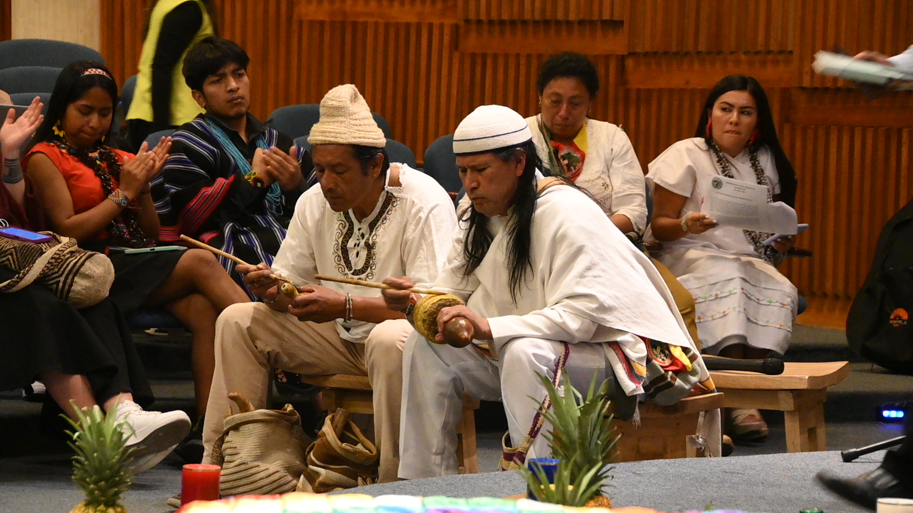
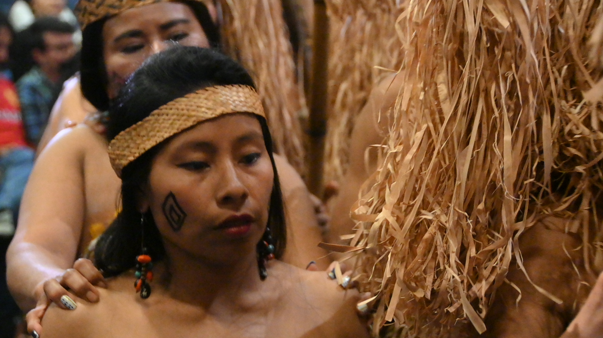
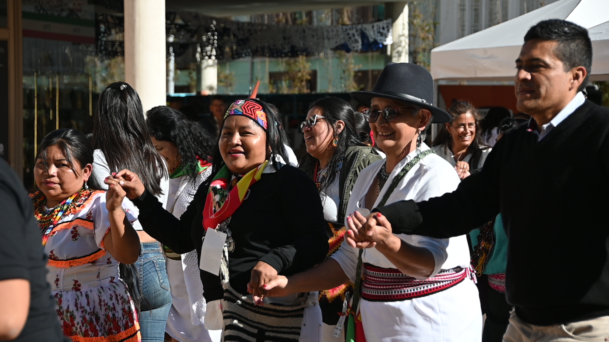

# Editorial
### Defendiendo Nuestra Unidad: Resistencia Originara ante las Traiciones en tiempos de cambio
Autor: Sixto Quintero. 

La unidad de los pueblos indígenas, basada en la solidaridad, es vital ante las amenazas actuales. La lucha por el territorio y la vida es vital más que nunca, fortalecer nuestros procesos de unidad es crucial para defender nuestros derechos y el legado ancestral.

Los tiempos pueden cambiar, pero las luchas siguen siendo las mismas. No hemos sido pasivos en la espera, desde nuestras autoridades ancestrales, desde las leyes de origen, resuenan las bases a las cuales no hemos renunciado. Un camino tortuoso donde hemos visto la muerte de muchos compañeros y compañeras indígenas, hemos visto desaparecer nuestros territorios en las fauces insaciables de avarientos. Ante todo esto, la unidad de los pueblos ha sido la mayor defensa. Esta unidad se basa en la solidaridad que nos ha permitido la identidad. Aunque, ahora está en riesgo.

Cuando el enemigo es claramente enemigo, cuando el adversario es claramente adversario, cuando el contradictor es claramente contradictor, la lucha tiene un origen sencillo, sabemos dónde ubicarnos, por donde caminar, el tono de nuestra voz y la fuerza de nuestros argumentos. Pero, cuando nuestro interlocutor hipócritamente no muestra sus intereses, se disfraza de aliado de los pueblos, pero en sus acciones y discursos deslegitima nuestra lucha, a la vez que nos pide una foto, porque para ellos esa imagen puesta en redes y periódicos es suficiente para decir que trabaja para el pueblo, entonces, nos encontramos en momentos adversos, que ponen más en riesgo nuestra existencia y nuestros territorios. Y cuando reclamamos entonces salen a mostrar esta foto y a decir que ellos siempre han estado dispuestos al diálogo y a trabajar por los pueblos. Acto seguido mandan amenazas con delegados, que por habernos quejado recibimos el castigo de la exclusión, de la invisibilización. Es como aquellos que al barrer echan el polvo debajo de la alfombra y si hace bulto entonces lo pisa. Pues no, no permitiremos esto, no nacimos para rendirnos ni para callarnos. Siempre estaremos caminando, en minga y con la palabra dulce como nuestras herramientas de lucha.

Es lamentable ver a muchos que acompañaron nuestro caminar, cuando teníamos que luchar unidos por la transformación necesaria de la Nación,  convertirse en la talanquera que obstaculiza la materialización de nuestras justas exigencias. Porque nosotros hacemos exigibilidad,  nos sentamos a concertar en las Consultas Previas o salimos a la Minga para beneficios colectivos; nosotros exigimos derechos, el derecho a la vida, de los territorios y su autonomía, de las familias, de los viejos y los niños, por los animales, las plantas, la tierra, lo que hay arriba y lo que se encuentra por debajo que es el equilibrio que debemos preservar en el cumplimiento de nuestra Ley de Origen. 

Esa es la tarea que nos dieron nuestros ancestros, cuando hemos vivido por estos designios hemos encontrado el buen vivir, el vivir alegres, a cada cual, según sus necesidades, a cada cual más allá de sus capacidades. Es en la comunidad que nosotros los Pueblos Indígenas  encontramos el sentido y la felicidad de vivir. Esto se hace más evidente cuando los vemos vivir con sus caras largas, la amargura de su voz, lo patético de sus placeres que nunca logran, que son vacíos, que son mentiras.

Ahora vemos a quienes decían acompañarnos y hasta defendernos convertirse en los mismos contra los que hemos luchado. El discurso sólo les sirvió para llegar al poder y convertirse en aquello que juraron no convertirse. Los pueblos no claudicamos, hemos tomado un respiro, pero estamos prestos a volver a levantarnos por nuestros derechos. En Minga aprendimos a vivir, en Minga hemos sobrevivido. El gobierno actual a sus dos años y con los cambios que viene haciendo tiene una oportunidad, cumplir con las exigencias que lo llevaron al poder. O se reimpulsa y da cumplimiento a los compromisos, o la historia será quien los borre.

# Opinión del mundo indígena
 
### El Rol Vital de los Pueblos Emberá en la protección de la Biodiversidad y equilibrio ecosistémico del Chocó Biogeográfico
----
Artículo de opinión: Higinio Obispo del pueblo Eperara Siapidaara.

Los Emberá son guardianes de la biodiversidad en el Chocó Biogeográfico. Sus prácticas ancestrales y políticas de conservación se basan en sus saberes tradicionales para sustentar ecosistemas y promover la restauración ecológica. Su Plan de Vida busca mantener estos conocimientos y asegurar beneficios comunitarios.

Los pueblos Emberá tienen conocimiento de primera mano sobre el estado de la biodiversidad, sobre sus territorios: como originarios, gobernantes y defensores de la tierra.  En este sentido es cuando el valor biológico y cultural de los pueblos Emberá es invaluable, tanto en el campo de protección de la naturaleza, como de sus conocimientos, prácticas y técnicas aportadas para la conservación de los ecosistemas y el sostenimiento de la biodiversidad, no sólo a nivel nacional sino mundial;. Las comunidades Emberá aún mantienen una vegetación muy natural en sus territorios (Dachi Drua) en lo que se conoce como el Chocó Biogeográfico, lo que significa que son de los mejor conservados, y por tanto de los que poseen mayor biodiversidad.

Prolongadamente, y desde una manera de vivir y comprender el mundo. Su concepción del cosmos, al igual que la de sus antepasados, está fundamentada en la creación maravillosa del origen <b>Tachi pîrâpôdapêdaa</b> (significa territorio donde el dios Sol nos dio un aliento a la vida). Su idea sobre el cosmos y de los mecanismos que regulan el universo se sustenta en los tres mundos.

Los Emberá dentro de sus habilidades han organizado normas milenarias para el uso, aprovechamiento y sostenimiento del territorio por ello han destinado áreas estratégicas de conservación de singulares especies de fauna y flora, ecosistemas, bosques, paisajes, y valores culturales de gran significación dentro de sus territorios. Éstas se encuentran en íntima convivencia con diversas comunidades que habitan al interior y/o en el área de influencia. La relación de las comunidades Emberá con estos espacios protegidos es de particular importancia, ya que sus modos de vida se han adaptado y sustentado, desde tiempos pretéritos, en diversos ecosistemas.

De esta manera han convivido en territorios de enorme valor biológico como es el caso del Chocó Biogeográfico. Desde el origen  han cohabitados con la naturaleza en una simbiosis y por eso, se han convertido en guardianes de la tierra de los ecosistemas y diferentes especies de vidas que conglomeran en aquellos territorios. Para llevar a cabo la conservación sostenible de la naturaleza acatan el legado de sus ancestros, de tal modo, siguen fomentando acciones con sus sabidurías para resguardar la vida de diferentes especies y sus hábitats. De otra parte, han desarrollado estrategias de trabajos de protección de los ecosistemas trascendentales en cooperación con las diferentes familias Emberá. Entendiendo los nuevos momentos han ido avanzado en organizar normas naturales propias en relación a la igualdad de derechos entre los seres vivientes. Lo cual ha permitido valorar el desempeño en las acciones de protección y conservación de la biodiversidad desde el conocimiento y la visión de políticas coherentes.  De otro lado están promoviendo la restauración ecológica en este nuevo entramado, su actuación es precisar el fortalecimiento y recuperación de lo fundamental en materia natural y la lucha contra la pérdida de biodiversidad.

Por lo anterior se puede decir, que los pueblos Emberá son actores cruciales en  la protección del equilibrio de los ecosistemas y por ende de todas las vidas que están en sus territorios; en ese sentido se ve que las tierras forestales de los Emberá son sumideros netos de carbono, secuestrando con cada hectárea un promedio de toneladas métricas de carbono al año. En promedio, estas tierras capturan tres cuartas partes más de carbono por hectárea que las tierras en otras manos.  Así mismo los acontecimientos concernientes a la biodiversidad están estrechamente vinculados con la identidad cultural, narraciones que se transmiten de generación a generación a través de cuentos, mitos entre otros. Esta notable convergencia espacial representa al mismo tiempo una enorme oportunidad y un desafío para la conservación de la biodiversidad y para la pervivencia de los medios de vida de los Emberá.

De este modo, se puede catalogar; que las contribuciones de los pueblos Emberá a la conservación de las especies silvestres, cultivadas y toda la biodiversidad en sus territorios no son un tema menor, han contribuido a mantener poblaciones diversas, abundantes, saludables en sus territorios, bajo valores de respeto, reciprocidad y responsabilidad.  Desde las prácticas ambientales y contextos espaciales, sus políticas, sistemas de gobierno y sus instituciones como el Jaibanismo se han desarrollado con miras a sostenerse bajo sus usos adecuados y racionalmente. 
La lucha por proteger sus territorios y con él, la naturaleza. Es clave, para la permanencia de la biodiversidad y mantener vivo el mundo natural, fundamental para la mitigación de la crisis por la reducción de la biodiversidad.  En este orden de ideas la proposición política de los Emberá es que la comunidad internacional sus gobiernos y el gobierno colombiano puedan aportar junto a los Emberá una política coherente a la conservación de la diversidad biológica y para ello se diseñen programas y proyectos a corto, mediano y largo alcance para que los Emberá desarrollen labores y su proyecto económico a partir de sus sabidurías y conocimiento sobre el  mantenimiento, uso y aprovechamiento de la biodiversidad, por otra parte.

Es imprescindible que los derechos, intereses y medios de subsistencia de las familias-comunidades indígenas Emberá se proyecte dentro de su Plan de Vida que es la política pública para sus territorios, en particular, se tienen que formular compromisos de respetar, preservar y mantener los conocimientos, las innovaciones y las prácticas de las comunidades Emberá; que entrañan estilos tradicionales de vida pertinentes para la protección y uso sostenible de la diversidad biológica, promover su aplicación más amplia bajo los parámetros de aprobación y participación de quienes poseen los conocimientos, innovaciones y prácticas en especial las autoridades tradicionales, Jaibanas, médicos y médicas tradicionales para fomentar que los beneficios derivados de la utilización de esos conocimientos, innovaciones y prácticas sean para los territorios, familias y comunidades Emberá.

# Buen Gobierno
### La Urgencia de la Unidad: Los Conflictos Internos amenazan al Movimiento Indígena, las divisiones políticas, económicas y culturales debilitan la lucha por los derechos en un momento de pulso para la transformación de Colombia.
----
Autora: Daniela Buitrago R. 

La unidad es crucial para los movimientos indígenas y sociales en Colombia, según la Ley de Origen de la ONIC. Sin embargo, las divisiones internas, alimentadas por diferencias ideológicas, competencia por recursos y pobreza, debilitan su lucha. Superar estas tensiones es urgente para enfrentar la violencia y construir un nuevo país.

En un país donde los movimientos indígenas y sociales han sido fundamentales en la defensa de los derechos humanos y la justicia social, las divisiones internas amenazan con socavar la efectividad de estas luchas. A medida que Colombia atraviesa una fase crucial en su historia política y social, los conflictos dentro de estos movimientos se han vuelto cada vez más visibles, generando preocupación entre líderes y aliados.

La Organización Nacional Indígena de Colombia (ONIC) ha advertido sobre esta situación en su Ley de Origen, un manifiesto político que hace un llamado a la Unidad como principio fundamental, entendiendo que el movimiento indígena es luz para el movimiento social y que muchas de las ganancias en términos legislativos y constitucionales en la construcción del Estado Colombiano se deben a la organicidad y al manejo de los conflictos internos, asimismo la ONIC reconoce que la Unidad es también con el movimiento social ya que las transformaciones del país no son únicas para la población indígena sino que todos los hermanos y hermanas merecen el alcance y goce de los derechos sabiendo que debe existir respeto en la diversidad.

Las diferencias ideológicas y políticas son una de las principales fuentes de tensión. "Tenemos un objetivo común, pero las diferencias sobre cómo alcanzarlo nos están frenando", palabras de la Asamblea de Autoridades Tradicionales de los Pueblos de la Gran Nación Emberá, 2024. Esta divergencia de enfoques ha llevado a rivalidades y opresiones internas que dificultan la coordinación y el avance hacia metas compartidas, en un contexto tan difícil como el que se está presentando en los territorios del país sobre: inseguridad, violación a los DDHH y reclutamiento forzado de niños, niñas y jóvenes indígenas. Esta situación equivale a que todo conflicto interno a nivel del movimiento indígena (en su dimensión local, regional o nacional) favorece, en últimas, a que se generen vacíos de poder, promoviendo que los actores armados, empresas multinacionales de carbono, mineras entre otros, avancen libremente sobre los territorios indígenas dejando sin ningún sentido los esfuerzos organizativos y la validez construida de los Pueblos Indígenas a nivel de sujetos políticos.

Además, la competencia por recursos limitados ha exacerbado las divisiones. La situación de pobreza multidimensional se presenta en el  49,2% de hogares de población indígena, en el caso de los afrodescendientes es del 43%, muy por encima de la situación de población sin pertenencia étnica, que es del 29%[^1]. Los indígenas son el grupo con mayor pobreza, lo que es más crítico en Chocó y en los departamentos de la Amazonía y la Orinoquía, donde el porcentaje de esta población en pobreza supera el 70% (DANE, 2022). El movimiento indígena aun con sus importantes avances y conquistas en el mundo de construcción jurídica del Estado aún tiene grandes retos en el aspecto material, que incluye contar con condiciones básicas mínimas como el acceso al agua, la educación, el empleo, la conectividad y acceso a recursos monetarios. Lo anterior, es clave para garantizar la protección del territorio y la reproducción de los 115 sistemas de conocimiento y gobierno de los Pueblos Originarios de Colombia.

Es por eso que el llamado de algunos de los forjadores del movimiento indígena es el de trascender de un mero acceso a recursos de los Sistemas de la Nación a dinamizar los territorios indígenas y ejercer realmente el gobierno propio, es decir, a crecer y dar el salto cualitativo de una vez. El movimiento indígena colombiano debe avanzar hacia la autonomía económica para que así pueda con sus propios recursos crear, impulsar y sostener sus propios proyectos políticos, no hacerlo, significará continuar debilitando procesos de autonomía económica y política por la dependencia en el financiamiento externo que ha llevado a una lucha interna por fondos que, en lugar de fortalecer la causa, ha generado una fragmentación preocupante, hecho que ha sido evidente en el marco del relacionamiento con el gobierno del cambio; prueba de ello la siguiente frase de una autoridad tradicional del pueblo Bari: "Es triste ver cómo el dinero puede dividir a quienes deberían estar luchando juntos".

Ante este panorama, el llamado a la unidad es más urgente que nunca. La fragmentación no solo debilita a los movimientos, sino que, también, los hace más vulnerables a la cooptación por parte de actores externos. "Si no superamos nuestras diferencias, nos arriesgamos a perder todo lo que hemos logrado", advirtió Luis Fernando Arias, Consejero Mayor de la ONIC 2017-2021, reconocido por su gran capacidad de dirección del movimiento indígena colombiano y por la orientación activa hacia un movimiento social unido.

El desafío ahora es encontrar maneras de construir esa unidad sin sacrificar la diversidad que caracteriza al movimiento indígena y al movimiento social. Para muchos, la clave está en fomentar un diálogo abierto y respetuoso que permita superar las diferencias y fortalecer la solidaridad sabiendo que la renovación generacional de los movimientos sociales está sucediendo y los líderes mayores saben de la urgencia de romper ciclos que permitan abrir caminos a la construcción de territorios en armonía y equilibrio sabiendo de los retos connaturales a la existencia pero dejando unas guías en aprendizajes incorporados para las nuevas generaciones que deben de seguir las luchas.

La Ley de Origen de la ONIC lo resume con claridad: "Es tiempo de construir un nuevo país". Este llamado no es solo un eslogan, sino un imperativo ético para aquellos que luchan por un cambio verdadero. La situación en Colombia es crítica, y los próximos meses serán decisivos. Con un contexto político en constante cambio, la capacidad del movimiento indígena y en unidad al movimiento social pueden dar el pulso necesario en la real transformación de la que somos legatarios el poder constituyente primario.

# Publicaciones del Consejero Jaizareama Gerardo Jumi
#### “Apoyamos la paz total, pero el balance es muy pobre”: líder indígena Gerardo Jumí
---
Entrevista del diario El Espectador al Consejero Gerardo Jumi evidenciando la situación de abandono y despreocupación de tomadores de decisión frente a la situación en los territorios indígenas. Denuncia el incumplimiento del acuerdo de paz, el aumento de violaciones de derechos humanos y la falta de garantías para un retorno seguro de las comunidades desplazadas (<a href="https://www.elespectador.com/politica/apoyamos-la-paz-total-pero-el-balance-es-muy-pobre-lider-indigena-gerardo-jumi/ " target="_blank">ver aquí</a>).

#### El mejor gol de la Copa América
---
Los pueblos indígenas de Colombia celebran a Luis Díaz, un talento Wayúu nacido de la Copa Indígena de Colombia, reflejando cómo el fútbol une y brinda alternativas de paz. Los jóvenes indígenas cuentan con grandes talentos como Díaz, fortalecerlos es el camino a la paz, la unidad y la alegría en Colombia, siendo un verdadero triunfo para el país (<a href="https://revistaraya.com/gerardo-jumi/758-el-mejor-gol-de-la-copa-america.html" target="_blank">ver aquí</a>).

            
 Si quieres, puedes reenviar este boletín a tus contactos o decirles que se apunten
                <a href="https://docs.google.com/forms/d/e/1FAIpQLSf7ya1kjLf2MY49mLGgkfslqdDGDQuk9rrrcDEHNNKmRllSNA/viewform" target="_blank" class="text-white">aquí</a>. Puedes escribirme con ideas, comentarios y sugerencias a sistemabuengobierno@onic.org.co
                o a mi cuenta de Twitter: @GerardoJumi

# Referencias

[^1]:Análisis con datos del Censo Nacional de Población y Vivienda de 2018.b Fuente: Maturana et al., 2022.  Condiciones de vida y pobreza multidimensional de poblaciones indígenas y afrodescendientes en Colombia a partir del CNPV 2018. DANE. Disponible en:<a href="https://www.dane.gov.co/files/censo2018/estudios-poscensales/05-condiciones-de-vida-y-pobreza-multidimensional-indigenas-afrodescendientes-colombia.pdf " target="_blank">ver aquí</a>

