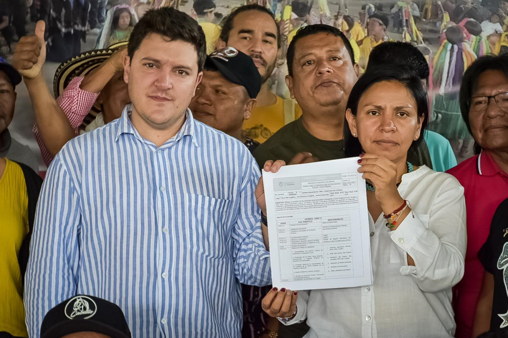

# Editorial
### Defendiendo Nuestra Unidad: Resistencia Originara ante las Traiciones en tiempos de cambio

La unidad de los pueblos indígenas, basada en la solidaridad, es vital ante las amenazas actuales. La lucha por el territorio y la vida es vital más que nunca, fortalecer nuestros procesos de unidad es crucial para defender nuestros derechos y el legado ancestral.

Los tiempos pueden cambiar, pero las luchas siguen siendo las mismas. No hemos sido pasivos en la espera, desde nuestras autoridades ancestrales, desde las leyes de origen, resuenan las bases a las cuales no hemos renunciado. Un camino tortuoso donde hemos visto la muerte de muchos compañeros y compañeras indígenas, hemos visto desaparecer nuestros territorios en las fauces insaciables de avarientos. Ante todo esto, la unidad de los pueblos ha sido la mayor defensa. Esta unidad se basa en la solidaridad que nos ha permitido la identidad. Aunque, ahora está en riesgo.

Cuando el enemigo es claramente enemigo, cuando el adversario es claramente adversario, cuando el contradictor es claramente contradictor, la lucha tiene un origen sencillo, sabemos dónde ubicarnos, por donde caminar, el tono de nuestra voz y la fuerza de nuestros argumentos. Pero, cuando nuestro interlocutor hipócritamente no muestra sus intereses, se disfraza de aliado de los pueblos, pero en sus acciones y discursos deslegitima nuestra lucha, a la vez que nos pide una foto, porque para ellos esa imagen puesta en redes y periódicos es suficiente para decir que trabaja para el pueblo, entonces, nos encontramos en momentos adversos, que ponen más en riesgo nuestra existencia y nuestros territorios. Y cuando reclamamos entonces salen a mostrar esta foto y a decir que ellos siempre han estado dispuestos al diálogo y a trabajar por los pueblos. Acto seguido mandan amenazas con delegados, que por habernos quejado recibimos el castigo de la exclusión, de la invisibilización. Es como aquellos que al barrer echan el polvo debajo de la alfombra y si hace bulto entonces lo pisa. Pues no, no permitiremos esto, no nacimos para rendirnos ni para callarnos. Siempre estaremos caminando, en minga y con la palabra dulce como nuestras herramientas de lucha.

Es lamentable ver a muchos que acompañaron nuestro caminar, cuando teníamos que luchar unidos por la transformación necesaria de la Nación,  convertirse en la talanquera que obstaculiza la materialización de nuestras justas exigencias. Porque nosotros hacemos exigibilidad,  nos sentamos a concertar en las Consultas Previas o salimos a la Minga para beneficios colectivos; nosotros exigimos derechos, el derecho a la vida, de los territorios y su autonomía, de las familias, de los viejos y los niños, por los animales, las plantas, la tierra, lo que hay arriba y lo que se encuentra por debajo que es el equilibrio que debemos preservar en el cumplimiento de nuestra Ley de Origen. 

Esa es la tarea que nos dieron nuestros ancestros, cuando hemos vivido por estos designios hemos encontrado el buen vivir, el vivir alegres, a cada cual, según sus necesidades, a cada cual más allá de sus capacidades. Es en la comunidad que nosotros los Pueblos Indígenas  encontramos el sentido y la felicidad de vivir. Esto se hace más evidente cuando los vemos vivir con sus caras largas, la amargura de su voz, lo patético de sus placeres que nunca logran, que son vacíos, que son mentiras.

Ahora vemos a quienes decían acompañarnos y hasta defendernos convertirse en los mismos contra los que hemos luchado. El discurso sólo les sirvió para llegar al poder y convertirse en aquello que juraron no convertirse. Los pueblos no claudicamos, hemos tomado un respiro, pero estamos prestos a volver a levantarnos por nuestros derechos. En Minga aprendimos a vivir, en Minga hemos sobrevivido. El gobierno actual a sus dos años y con los cambios que viene haciendo tiene una oportunidad, cumplir con las exigencias que lo llevaron al poder. O se reimpulsa y da cumplimiento a los compromisos, o la historia será quien los borre.

# Opinión del mundo indígena
 
### El Rol Vital de los Pueblos Emberá en la protección de la Biodiversidad y equilibrio ecosistémico del Chocó Biogeográfico
----

Artículo de opinión: Higinio Obispo del pueblo Eperara Siapidaara.

Los Emberá son guardianes de la biodiversidad en el Chocó Biogeográfico. Sus prácticas ancestrales y políticas de conservación se basan en sus saberes tradicionales para sustentar ecosistemas y promover la restauración ecológica. Su Plan de Vida busca mantener estos conocimientos y asegurar beneficios comunitarios.

Los pueblos Emberá tienen conocimiento de primera mano sobre el estado de la biodiversidad, sobre sus territorios: como originarios, gobernantes y defensores de la tierra.  En este sentido es cuando el valor biológico y cultural de los pueblos Emberá es invaluable, tanto en el campo de protección de la naturaleza, como de sus conocimientos, prácticas y técnicas aportadas para la conservación de los ecosistemas y el sostenimiento de la biodiversidad, no sólo a nivel nacional sino mundial;. Las comunidades Emberá aún mantienen una vegetación muy natural en sus territorios (Dachi Drua) en lo que se conoce como el Chocó Biogeográfico, lo que significa que son de los mejor conservados, y por tanto de los que poseen mayor biodiversidad.

Prolongadamente, y desde una manera de vivir y comprender el mundo. Su concepción del cosmos, al igual que la de sus antepasados, está fundamentada en la creación maravillosa del origen Tachi pîrâpôdapêdaa (significa territorio donde el dios Sol nos dio un aliento a la vida). Su idea sobre el cosmos y de los mecanismos que regulan el universo se sustenta en los tres mundos.

Los Emberá dentro de sus habilidades han organizado normas milenarias para el uso, aprovechamiento y sostenimiento del territorio por ello han destinado áreas estratégicas de conservación de singulares especies de fauna y flora, ecosistemas, bosques, paisajes, y valores culturales de gran significación dentro de sus territorios. Éstas se encuentran en íntima convivencia con diversas comunidades que habitan al interior y/o en el área de influencia. La relación de las comunidades Emberá con estos espacios protegidos es de particular importancia, ya que sus modos de vida se han adaptado y sustentado, desde tiempos pretéritos, en diversos ecosistemas.

De esta manera han convivido en territorios de enorme valor biológico como es el caso del Chocó Biogeográfico. Desde el origen  han cohabitados con la naturaleza en una simbiosis y por eso, se han convertido en guardianes de la tierra de los ecosistemas y diferentes especies de vidas que conglomeran en aquellos territorios. Para llevar a cabo la conservación sostenible de la naturaleza acatan el legado de sus ancestros, de tal modo, siguen fomentando acciones con sus sabidurías para resguardar la vida de diferentes especies y sus hábitats. De otra parte, han desarrollado estrategias de trabajos de protección de los ecosistemas trascendentales en cooperación con las diferentes familias Emberá. Entendiendo los nuevos momentos han ido avanzado en organizar normas naturales propias en relación a la igualdad de derechos entre los seres vivientes. Lo cual ha permitido valorar el desempeño en las acciones de protección y conservación de la biodiversidad desde el conocimiento y la visión de políticas coherentes.  De otro lado están promoviendo la restauración ecológica en este nuevo entramado, su actuación es precisar el fortalecimiento y recuperación de lo fundamental en materia natural y la lucha contra la pérdida de biodiversidad.

Por lo anterior se puede decir, que los pueblos Emberá son actores cruciales en  la protección del equilibrio de los ecosistemas y por ende de todas las vidas que están en sus territorios; en ese sentido se ve que las tierras forestales de los Emberá son sumideros netos de carbono, secuestrando con cada hectárea un promedio de toneladas métricas de carbono al año. En promedio, estas tierras capturan tres cuartas partes más de carbono por hectárea que las tierras en otras manos.  Así mismo los acontecimientos concernientes a la biodiversidad están estrechamente vinculados con la identidad cultural, narraciones que se transmiten de generación a generación a través de cuentos, mitos entre otros. Esta notable convergencia espacial representa al mismo tiempo una enorme oportunidad y un desafío para la conservación de la biodiversidad y para la pervivencia de los medios de vida de los Emberá.

De este modo, se puede catalogar; que las contribuciones de los pueblos Emberá a la conservación de las especies silvestres, cultivadas y toda la biodiversidad en sus territorios no son un tema menor, han contribuido a mantener poblaciones diversas, abundantes, saludables en sus territorios, bajo valores de respeto, reciprocidad y responsabilidad.  Desde las prácticas ambientales y contextos espaciales, sus políticas, sistemas de gobierno y sus instituciones como el Jaibanismo se han desarrollado con miras a sostenerse bajo sus usos adecuados y racionalmente. 
La lucha por proteger sus territorios y con él, la naturaleza. Es clave, para la permanencia de la biodiversidad y mantener vivo el mundo natural, fundamental para la mitigación de la crisis por la reducción de la biodiversidad.  En este orden de ideas la proposición política de los Emberá es que la comunidad internacional sus gobiernos y el gobierno colombiano puedan aportar junto a los Emberá una política coherente a la conservación de la diversidad biológica y para ello se diseñen programas y proyectos a corto, mediano y largo alcance para que los Emberá desarrollen labores y su proyecto económico a partir de sus sabidurías y conocimiento sobre el  mantenimiento, uso y aprovechamiento de la biodiversidad, por otra parte.

Es imprescindible que los derechos, intereses y medios de subsistencia de las familias-comunidades indígenas Emberá se proyecte dentro de su Plan de Vida que es la política pública para sus territorios, en particular, se tienen que formular compromisos de respetar, preservar y mantener los conocimientos, las innovaciones y las prácticas de las comunidades Emberá; que entrañan estilos tradicionales de vida pertinentes para la protección y uso sostenible de la diversidad biológica, promover su aplicación más amplia bajo los parámetros de aprobación y participación de quienes poseen los conocimientos, innovaciones y prácticas en especial las autoridades tradicionales, Jaibanas, médicos y médicas tradicionales para fomentar que los beneficios derivados de la utilización de esos conocimientos, innovaciones y prácticas sean para los territorios, familias y comunidades Emberá.

# Eventos destacados
### Pueblos Emberá Ejercen poder Constituyente en Unidad por sus Derechos
---- 
Entre el 19 y 22 de junio del año en curso se desarrolló en el departamento de Risaralda la Asamblea Nacional de las Autoridades de los Pueblos de la Nación Emberá de Colombia, para dar cumplimiento a los mandatos de los tres Congresos realizados en Pereira – Risaralda y Dobio – Valle del Cauca.

Esta Asamblea se realizó en el marco del poder constituyente que reside en los Pueblos Emberá Dóbida, Emberá Eyabida, Emberá Chamí, Emberá Katío y Eperara Siapidaara, que se encuentran ubicados en al menos 15 departamentos de Colombia [^5].

Durante la Asamblea se desarrollaron espacios autónomos y de concertación con las entidades del Gobierno Nacional. En lo que refiere al relacionamiento con el Gobierno Nacional se suscribieron acuerdos como: La instalación de una Comisión Nacional de Concertación de los Pueblos de la Nación Emberá con el Gobierno Nacional mediante la expedición de un decreto que inicialmente será por resolución del Ministerio del Interior, implementación de planes de retorno y reubicación de la población Emberá en condición de desplazamiento forzado, expedición de un CONPES para la atención de las principales problemáticas generadas por el conflicto armado que conlleve a la estabilización socioeconómica de los Pueblos Emberá que han sido víctimas, contemplando comunidades desplazadas receptoras y de retorno.

Fotografía:Firma de acuerdos entre el Gobierno Nacional y la Asamblea Nacional de Autoridades de los pueblos de la Nación Emberá

Asimismo, durante la Asamblea se visibilizaron las diferentes problemáticas sociales, económicas, ambientales y territoriales de la Nación Emberá como la pobreza, la mendicidad, los suicidios, la desnutrición y la situación de las víctimas Emberá a razón del conflicto armado que han sufrido afectaciones e impactos desde hace más de 6 décadas.  Teniendo en cuenta estas problemáticas, la Asamblea definió que su atención o solución serán asumidas en unidad a partir de un escenario de solidaridad, buen gobierno y capacidad propositiva y de concertación en el marco de su poder constituyente. En este sentido, aprobó que constituirá la Confederación Nacional de los Pueblos de la Nación Emberá que contará la siguiente estructura de gobierno: Congreso Nacional de la Nación Emberá, Asamblea Nacional de Autoridades Emberá, Consejo Directivo de Gobierno y Consejo General de Gobierno.

Esta Confederación se caracterizará por tener una forma de gobierno democrática, por garantizar la participación de un 50% de las mujeres o cuota de género en las estructuras de gobierno y por tener una representación legal plural y colegiada integrada por: Consejera Mayor Representante Legal, Consejero Mayor Representante Legal y Consejero General Representante Legal. Esta representación legal plural y colegiada permitirá una mayor representación de los amplios territorios Emberá y rápida rotación en la representación para la ordenación del gasto, la firma de convenios y la suscripción de actos jurídicos en nombre de la Confederación con la autorización del Consejo General de Gobierno. 

Así entonces, el surgimiento de esta Confederación surge para que se avance como Pueblos Emberá en la búsqueda conjunta y en unidad de soluciones a problemáticas comunes, también, para que se impulse y acompañe a los distintos procesos organizativos regionales y locales Emberá ya existentes en sus apuestas de solución, sin que estos pierdan su autonomía y la posibilidad de seguir fortaleciéndose

Fotografía:Asamblea Nacional de Autoridades de los Pueblos de la Nación Emberá junto con los representantes del gobierno nacional

En la siguiente entrega de este Boletín de Buen Gobierno de la ONIC se informará con detalle sobre los avances en el cumplimiento de los acuerdos concertados entre el Gobierno Nacional y la Asamblea de la Nación Emberá.

# Buen Gobierno
### Así va el Plan Estratégico de la ONIC
El actual Consejo Mayor de Gobierno se encuentra avanzando en la aprobación del Plan Estratégico de la Organización Nacional Indígena de Colombia (ONIC), en cumplimiento del mandato 30 del VIII Congreso Nacional de los Pueblos Indígenas reiterado en el X Congreso.

Este Plan Estratégico está integrado por líneas de acción, programas y proyectos para cada una de las diez (10) Consejerías que lideraron autónomamente la construcción de su contenido y que liderarán su implementación, basándose en los mandatos estatutarios y políticos de la ONIC derivados de la Ley de Gobierno Propio y el X Congreso. Este resultado fue posible gracias a la puesta en marcha de una metodología dialógica participativa a nivel político y técnico coordinada por el Consejero Secretario General, Gerardo Jumí, que permitió caminar la palabra dulce tanto con las Consejerías como con las autoridades indígenas participantes de la construcción horizontal de un documento estratégico para el futuro de la ONIC, los Pueblos Indígenas y las organizaciones que están en su cobertura. 

Con su adopción, el Plan Estratégico se convertirá en el instrumento propio de planeación política - técnica de la ONIC y el marco rector que orientará su actuación a corto, mediano y largo plazo, con la consecuente alineación o enfoque de toda la organización hacia el cumplimiento de los mandatos recibidos. 

Así entonces, se concluye que este Plan Estratégico es una oportunidad histórica para revitalizar, fortalecer y perfeccionar integralmente a la ONIC como Autoridad Nacional de Gobierno Indígena y el “sol que alumbra para todos” los Pueblos y Naciones Indígenas de Colombia que anhelan tanto volver al origen como garantizar su pervivencia física y cultural; teniendo en cuenta sus planes de vida, planes de salvaguarda, sistemas de conocimientos ancestrales, la fortaleza de sus estructuras de gobierno de base, así como los principios de unidad, territorio, cultura y autonomía. En otros términos, este Plan Estratégico es una oportunidad para actuar desde el Buen Corazón para un Buen Gobierno para cumplir y respetar tanto lo mandatado por las autoridades indígenas y el legado que han recibido los Pueblos Originarios de sus ancestros. 

En la actualidad se cuenta con un documento consolidado y se está proyectando la plataforma en línea para el seguimiento al cumplimiento del Plan Estratégico. En la imagen de abajo se puede identificar que el Plan Estratégico de la ONIC cuenta con 29 líneas de acción que se desarrollarán en 42 programas, que a su vez cuentan con 97 proyectos. 

Figura. Panel de mando del Sistema de Gestión de Plan Estratégico de la ONIC

 

# Publicaciones del Consejero Jaizareama Gerardo Jumi

### ¡Nos están matando y el Fiscal Barbosa no hizo nada! ¡Los Pueblos Indígenas de Colombia exigen el cambio de Fiscal ya!
---

El Informe del Observatorio de Derechos Humanos de los Pueblos Indígenas de la ONIC de 2023 demuestra en cifras la ineficacia de la Fiscalía colombiana ante el genocidio de los Pueblos Indígenas. La ONIC exige la elección urgente de una nueva fiscal comprometida con la justicia para que nunca se repitan los hechos aberrantes que se han presentado contra los Pueblos Indígenas. <a href="https://www.revistaraya.com/gerardo-jumi/589-nos-estan-matando-y-el-fiscal-barbosa-no-hizo-nada-los-pueblos-indigenas-de-colombia-exigen-el-cambio-de-fiscal-ya.html" target="_blank">ver aquí</a> 

#### Raíces del genocidio: Gaza y territorios indígenas
---
En medio de la tragedia de miles de palestinos que están siendo asesinados, a la vez, existen múltiples genocidios contra nuestros Pueblos indígenas en Colombia, en común tienen el interés económico que brindan las riquezas de estos territorios y lo incómodo que pueden ser las comunidades locales. Se resalta la lucha del gran Kimy Pernía por defender el Río Sinú, territorio de los Emberá Katio, y el desenlace fatídico en manos del paramilitar Salvatore Mancuso. De todas maneras la resistencia persiste y la solidaridad entre Pueblos también, el llamado es a realizar la economía propia del buen vivir. <a href="https://revistaraya.com/gerardo-jumi/598-raices-del-genocidio-gaza-y-territorios-indigenas.html" target="_blank">ver aquí</a>

            
 Si quieres, puedes reenviar este boletín a tus contactos o decirles que se apunten
                <a href="https://docs.google.com/forms/d/e/1FAIpQLSf7ya1kjLf2MY49mLGgkfslqdDGDQuk9rrrcDEHNNKmRllSNA/viewform" target="_blank" class="text-white">aquí</a>. Puedes escribirme con ideas, comentarios y sugerencias a sistemabuengobierno@onic.org.co
                o a mi cuenta de Twitter: @GerardoJumi

# Referencias

[^1]:Estatutos de 2003 de la ONIC registrados en la Cámara de Comercio.

[^2]: Declaración de Emergencia Humanitaria de y por los Pueblos Indígenas, 09 de agosto de 2019. Disponible en: <a href="https://www.onic.org.co/comunicados-onic/3105-declaracion-de-emergencia-humanitaria-de-y-por-los-pueblos-indigenas" target="_blank">ver aquí</a>

[^3]: Información sistematizada en el Observatorio de Derechos Humanos de la ONIC desde 2016 como esfuerzo propio para monitorear la situación territorial de Derechos Humanos de acuerdo a la política del Acuerdo Final de Paz.

[^4]: Ministerio de Salud y Protección Social/Instituto Nacional de Salud./Instituto Colombiano de Bienestar Familiar. Boletín de Prensa No 04 de 2024, Disminuye la mortalidad por desnutrición aguda en niños y niñas menores de cinco años en el país. Disponible en: <a href="https://www.minsalud.gov.co/Paginas/Disminuye-la-mortalidad-por-desnutricion-aguda-en-ninos-y-ninas-menores-de-cinco-anos-en-el-pais.aspx" target="_blank">ver aquí</a>

[^5]: Córdoba: Cabildos Mayores Embera Katío del Alto Sinú – CAMAEMKA, Resguardo Quebrada Cañaveral y Resguardo Dochama San José de Uré. Antioquia: Organización Indígena de Antioquia – OIA. Caldas: Consejo Regional Indígena de Caldas - CRIDEC y Organización Regional Indígena de Caldas - ORICAL. Risaralda: Consejo Regional Indígena de Risaralda – CRIR. Tolima: Comunidad Indígena Biania Embera Chami. Quindío: Organización Regional Indígena del Quindío – ORIQUIN. Valle del Cauca: ACIVA y Organización Regional Indígena del Valle del Cauca – ORIVAC. Nariño: Asociación de Cabildos Indígenas Eperara Siapidaara de Nariño – ACIESNA. Cauca: ACIESCA. Chocó: Asociación de Cabildos Indígenas Embera, Wounaan, Katío, Chamí y Tule del Departamento del Chocó – ASOREWA, Federación de Asociaciones de Cabildos Indígenas del Departamento del Chocó – FEDEOREWA, Consejo Regional Indígena del Chocó – CRICH, Asociación de Autoridades Indígenas Embera Katios del Departamento del Chocó -ASOKATÍO y Gobierno Ancestral Territorial de los Pueblos Indígenas del Chocó - AUTORIDAD TRADICIONAL. Alto Andágueda: ZONAS 1 - 3. Caquetá (Comunidad). Magdalena Medio, Santander: Comunidad Emberá Chamí Dachi Drua. Meta: Resguardo La Julia. Putumayo: Asociación ASCEK – KIPAR. 

[^6]: Intervención de la Compañera Emberá Chami Directora de la Unidad para la Atención y Reparación Integral a las Víctimas Patricia Tobón ante la Corte Constitucional en la sesión técnica de la Sala Especial de Seguimiento a la Sentencia T-025 de 2004, 10 de mayo de 2024.

